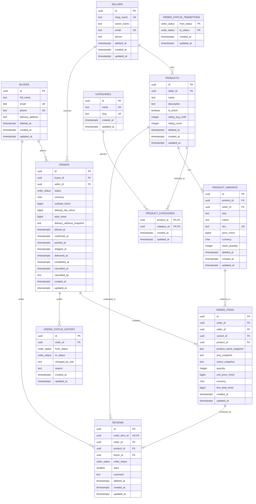

# WearHub Data Model

This document specifies the relational data model for the WearHub marketplace in PostgreSQL 16. All primary keys use `uuid DEFAULT gen_random_uuid()`, all monetary values are stored as `bigint` minor units (kobo) with an accompanying `char(3)` currency column (`NGN`), and all timestamps are `timestamptz`.

---

## 1. Entity Definitions (11 Tables)

### 1.1 `buyers`
Registered retail customers in Lagos who browse products, place orders, and submit reviews.
- **Identifier**: `id uuid DEFAULT gen_random_uuid() PRIMARY KEY`
- **Soft Deletion**: Supported via `deleted_at` for account deactivation while preserving order history.

| Field | Postgres Type | Required | Notes |
| :--- | :--- | :--- | :--- |
| `id` | `uuid` | Yes | Primary key (`pk_buyers`), generated default UUIDv4. |
| `full_name` | `text` | Yes | Buyer full name. |
| `email` | `text` | Yes | Unique login/contact email (`uq_buyers_email`). |
| `phone` | `text` | Yes | Unique phone number for delivery contact (`uq_buyers_phone`). |
| `delivery_address` | `text` | Yes | Default shipping address in Lagos. |
| `deleted_at` | `timestamptz` | No | Soft delete timestamp; null for active accounts. |
| `created_at` | `timestamptz` | Yes | Record creation timestamp (`DEFAULT now()`). |
| `updated_at` | `timestamptz` | Yes | Record update timestamp (`DEFAULT now()`). |

---

### 1.2 `sellers`
Fashion brands and boutiques that list ready-to-wear garments and fulfill customer orders.
- **Identifier**: `id uuid DEFAULT gen_random_uuid() PRIMARY KEY`
- **Soft Deletion**: Supported via `deleted_at` for shop deactivation without deleting past sales records.

| Field | Postgres Type | Required | Notes |
| :--- | :--- | :--- | :--- |
| `id` | `uuid` | Yes | Primary key (`pk_sellers`), generated default UUIDv4. |
| `shop_name` | `text` | Yes | Unique boutique brand name (`uq_sellers_shop_name`). |
| `owner_name` | `text` | Yes | Legal business owner or representative. |
| `email` | `text` | Yes | Unique merchant contact email (`uq_sellers_email`). |
| `phone` | `text` | Yes | Merchant business phone number. |
| `deleted_at` | `timestamptz` | No | Soft delete timestamp; null for active sellers. |
| `created_at` | `timestamptz` | Yes | Record creation timestamp (`DEFAULT now()`). |
| `updated_at` | `timestamptz` | Yes | Record update timestamp (`DEFAULT now()`). |

---

### 1.3 `categories`
Curated fashion taxonomy used to organize and filter garment listings.
- **Identifier**: `id uuid DEFAULT gen_random_uuid() PRIMARY KEY`
- **Soft Deletion**: Not soft-deleted; platform-wide taxonomy records are managed directly by admins.

| Field | Postgres Type | Required | Notes |
| :--- | :--- | :--- | :--- |
| `id` | `uuid` | Yes | Primary key (`pk_categories`), generated default UUIDv4. |
| `name` | `text` | Yes | Category display name (`uq_categories_name`). |
| `slug` | `text` | Yes | URL-friendly unique slug (`uq_categories_slug`). |
| `created_at` | `timestamptz` | Yes | Record creation timestamp (`DEFAULT now()`). |
| `updated_at` | `timestamptz` | Yes | Record update timestamp (`DEFAULT now()`). |

---

### 1.4 `products`
Ready-to-wear clothing catalog items created by sellers.
- **Identifier**: `id uuid DEFAULT gen_random_uuid() PRIMARY KEY`
- **Composite Unique**: `(id, seller_id)` (`uq_products_id_seller`) to enable composite foreign key checks.
- **Soft Deletion**: Supported via `deleted_at` for archiving discontinued items.

| Field | Postgres Type | Required | Notes |
| :--- | :--- | :--- | :--- |
| `id` | `uuid` | Yes | Primary key (`pk_products`), generated default UUIDv4. |
| `seller_id` | `uuid` | Yes | Foreign key to `sellers(id)` (`fk_products_seller`). |
| `name` | `text` | Yes | Garment title. |
| `description` | `text` | Yes | Fabric details, care instructions, and styling notes. |
| `is_active` | `boolean` | Yes | Visibility flag (`DEFAULT true`). |
| `rating_avg_x100` | `integer` | Yes | Cached average rating x100 (e.g. 450 = 4.50 stars, `DEFAULT 0`). |
| `rating_count` | `integer` | Yes | Cached total count of approved reviews (`DEFAULT 0`). |
| `deleted_at` | `timestamptz` | No | Soft delete timestamp. |
| `created_at` | `timestamptz` | Yes | Record creation timestamp (`DEFAULT now()`). |
| `updated_at` | `timestamptz` | Yes | Record update timestamp (`DEFAULT now()`). |

---

### 1.5 `product_categories`
Many-to-many join table linking products to one or more taxonomy categories.
- **Identifier**: Composite Primary Key `(product_id, category_id)` (`pk_product_categories`).
- **Soft Deletion**: Not soft-deleted; associations are removed on catalog reorganization.

| Field | Postgres Type | Required | Notes |
| :--- | :--- | :--- | :--- |
| `product_id` | `uuid` | Yes | Foreign key to `products(id)` ON DELETE CASCADE (`fk_product_categories_product`). |
| `category_id` | `uuid` | Yes | Foreign key to `categories(id)` ON DELETE RESTRICT (`fk_product_categories_category`). |
| `created_at` | `timestamptz` | Yes | Record creation timestamp (`DEFAULT now()`). |
| `updated_at` | `timestamptz` | Yes | Record update timestamp (`DEFAULT now()`). |

---

### 1.6 `product_variants`
Specific stock-keeping units defining a unique size and colour option with dedicated inventory and price.
- **Identifier**: `id uuid DEFAULT gen_random_uuid() PRIMARY KEY`
- **Constraints**:
  - `uq_product_variants_product_size_colour`: `UNIQUE (product_id, size, colour)`
  - `uq_product_variants_sku`: `UNIQUE (sku)`
  - `ck_product_variants_stock_nonneg`: `CHECK (stock_quantity >= 0)`
  - `uq_product_variants_composite`: `UNIQUE (id, seller_id, product_id, price_minor, currency)`
- **Soft Deletion**: Supported via `deleted_at` when retiring specific size/colour variants.

| Field | Postgres Type | Required | Notes |
| :--- | :--- | :--- | :--- |
| `id` | `uuid` | Yes | Primary key (`pk_product_variants`), generated default UUIDv4. |
| `product_id` | `uuid` | Yes | Foreign key to `products(id)` (`fk_product_variants_product`). |
| `seller_id` | `uuid` | Yes | Denormalised foreign key to `sellers(id)` (`fk_product_variants_seller`). |
| `size` | `text` | Yes | Garment size (e.g., S, M, L, XL, UK 10). |
| `colour` | `text` | Yes | Garment colour (e.g., Black, Indigo, Olive). |
| `sku` | `text` | Yes | Unique stock keeping unit code (`uq_product_variants_sku`). |
| `price_minor` | `bigint` | Yes | Unit price in kobo (e.g. 2500000 = 25,000 NGN). |
| `currency` | `char(3)` | Yes | Currency code (`DEFAULT 'NGN'`). |
| `stock_quantity` | `integer` | Yes | Available stock; must be non-negative (`ck_product_variants_stock_nonneg`). |
| `deleted_at` | `timestamptz` | No | Soft delete timestamp. |
| `created_at` | `timestamptz` | Yes | Record creation timestamp (`DEFAULT now()`). |
| `updated_at` | `timestamptz` | Yes | Record update timestamp (`DEFAULT now()`). |

---

### 1.7 `orders`
A purchase contract placed by a buyer with a single seller, payable on delivery.
- **Identifier**: `id uuid DEFAULT gen_random_uuid() PRIMARY KEY`
- **Constraints**:
  - Composite key for reviews/items: `UNIQUE (id, buyer_id, status)` and `UNIQUE (id, seller_id)`
- **Deletion Policy**: **NEVER deleted**. Orders are permanent financial and audit legal records.

| Field | Postgres Type | Required | Notes |
| :--- | :--- | :--- | :--- |
| `id` | `uuid` | Yes | Primary key (`pk_orders`), generated default UUIDv4. |
| `buyer_id` | `uuid` | Yes | Foreign key to `buyers(id)` (`fk_orders_buyer`). |
| `seller_id` | `uuid` | Yes | Foreign key to `sellers(id)` (`fk_orders_seller`). |
| `status` | `order_status` | Yes | Enum (`placed`, `confirmed`, `packed`, `shipped`, `delivered`, `completed`, `cancelled`, `return_requested`, `returned`). |
| `currency` | `char(3)` | Yes | Currency code (`DEFAULT 'NGN'`). |
| `subtotal_minor` | `bigint` | Yes | Sum of line totals in kobo; verified by trigger `trg_orders_subtotal_matches`. |
| `delivery_fee_minor` | `bigint` | Yes | Fixed delivery fee in kobo. |
| `total_minor` | `bigint` | Yes | Generated column: `GENERATED ALWAYS AS (subtotal_minor + delivery_fee_minor) STORED`. |
| `delivery_address_snapshot` | `text` | Yes | Immutable copy of delivery address at checkout. |
| `placed_at` | `timestamptz` | Yes | Timestamp order placed (`DEFAULT now()`). |
| `confirmed_at` | `timestamptz` | No | Timestamp seller confirmed order. |
| `packed_at` | `timestamptz` | No | Timestamp seller packed package. |
| `shipped_at` | `timestamptz` | No | Timestamp courier departed with package. |
| `delivered_at` | `timestamptz` | No | Timestamp package received by buyer. |
| `completed_at` | `timestamptz` | No | Timestamp finalized (7 days post-delivery or after return resolution). |
| `cancelled_at` | `timestamptz` | No | Timestamp order was cancelled. |
| `cancelled_by` | `text` | No | Role that cancelled the order (`'buyer'`, `'seller'`, `'admin'`). |
| `created_at` | `timestamptz` | Yes | Record creation timestamp (`DEFAULT now()`). |
| `updated_at` | `timestamptz` | Yes | Record update timestamp (`DEFAULT now()`). |

---

### 1.8 `order_items`
Immutable line items connecting an order to a purchased variant with price and item attribute snapshots.
- **Identifier**: `id uuid DEFAULT gen_random_uuid() PRIMARY KEY`
- **Constraints**:
  - `uq_order_items_order_variant`: `UNIQUE (order_id, variant_id)`
  - `ck_order_items_quantity_positive`: `CHECK (quantity > 0)`
  - `fk_order_items_order_seller`: Composite FK `(order_id, seller_id)` to `orders(id, seller_id)`
  - `fk_order_items_variant_seller`: Composite FK `(variant_id, seller_id, product_id, unit_price_minor, currency)` to `product_variants(id, seller_id, product_id, price_minor, currency)`
- **Deletion Policy**: **NEVER deleted**. Line items are immutable financial ledger lines.

| Field | Postgres Type | Required | Notes |
| :--- | :--- | :--- | :--- |
| `id` | `uuid` | Yes | Primary key (`pk_order_items`), generated default UUIDv4. |
| `order_id` | `uuid` | Yes | Foreign key to `orders(id)` (`fk_order_items_order`). |
| `seller_id` | `uuid` | Yes | Denormalised seller ID to enforce single-seller integrity. |
| `variant_id` | `uuid` | Yes | Foreign key to `product_variants(id)` (`fk_order_items_variant`). |
| `product_id` | `uuid` | Yes | Denormalised foreign key to `products(id)`. |
| `product_name_snapshot` | `text` | Yes | Locked product title at time of order. |
| `size_snapshot` | `text` | Yes | Locked size name at time of order. |
| `colour_snapshot` | `text` | Yes | Locked colour name at time of order. |
| `quantity` | `integer` | Yes | Number of units purchased (`CHECK (quantity > 0)`). |
| `unit_price_minor` | `bigint` | Yes | Locked unit price in kobo at time of order. |
| `currency` | `char(3)` | Yes | Currency code (`DEFAULT 'NGN'`). |
| `line_total_minor` | `bigint` | Yes | Generated column: `GENERATED ALWAYS AS (quantity * unit_price_minor) STORED`. |
| `created_at` | `timestamptz` | Yes | Record creation timestamp (`DEFAULT now()`). |
| `updated_at` | `timestamptz` | Yes | Record update timestamp (`DEFAULT now()`). |

---

### 1.9 `order_status_transitions`
Reference state machine table defining the 11 legal state transitions for orders.
- **Identifier**: Composite Primary Key `(from_status, to_status)` (`pk_order_status_transitions`).
- **Deletion Policy**: Static configuration table; never deleted during runtime.

| Field | Postgres Type | Required | Notes |
| :--- | :--- | :--- | :--- |
| `from_status` | `order_status` | Yes | Starting status enum. |
| `to_status` | `order_status` | Yes | Target status enum. |
| `created_at` | `timestamptz` | Yes | Record creation timestamp (`DEFAULT now()`). |
| `updated_at` | `timestamptz` | Yes | Record update timestamp (`DEFAULT now()`). |

---

### 1.10 `order_status_history`
Append-only audit log tracking every status transition event for an order.
- **Identifier**: `id uuid DEFAULT gen_random_uuid() PRIMARY KEY`
- **Deletion Policy**: **NEVER deleted**. Immutable security and operations audit log.

| Field | Postgres Type | Required | Notes |
| :--- | :--- | :--- | :--- |
| `id` | `uuid` | Yes | Primary key (`pk_order_status_history`), generated default UUIDv4. |
| `order_id` | `uuid` | Yes | Foreign key to `orders(id)` (`fk_order_status_history_order`). |
| `from_status` | `order_status` | No | Prior status (null upon initial creation). |
| `to_status` | `order_status` | Yes | Destination status. |
| `changed_by_role` | `text` | Yes | Role initiating transition (`'buyer'`, `'seller'`, `'admin'`, `'system'`). |
| `reason` | `text` | No | Optional cancellation/return or transition explanation. |
| `created_at` | `timestamptz` | Yes | Record creation timestamp (`DEFAULT now()`). |
| `updated_at` | `timestamptz` | Yes | Record update timestamp (`DEFAULT now()`). |

---

### 1.11 `reviews`
Post-purchase product ratings and comments submitted by buyers for completed order items.
- **Identifier**: `id uuid DEFAULT gen_random_uuid() PRIMARY KEY`
- **Constraints**:
  - `uq_reviews_order_item`: `UNIQUE (order_item_id)` (one review per item)
  - `fk_reviews_order_completed`: Composite FK `(order_id, buyer_id, order_status)` to `orders(id, buyer_id, status)`
  - `ck_reviews_order_status_completed`: `CHECK (order_status = 'completed')`
  - `ck_reviews_stars`: `CHECK (stars BETWEEN 1 AND 5)`
- **Soft Deletion**: Supported via `deleted_at` for moderation/removal of abusive content.

| Field | Postgres Type | Required | Notes |
| :--- | :--- | :--- | :--- |
| `id` | `uuid` | Yes | Primary key (`pk_reviews`), generated default UUIDv4. |
| `order_item_id` | `uuid` | Yes | Unique foreign key to `order_items(id)` (`uq_reviews_order_item`). |
| `order_id` | `uuid` | Yes | Foreign key to `orders(id)`. |
| `product_id` | `uuid` | Yes | Foreign key to `products(id)` (`fk_reviews_product`). |
| `buyer_id` | `uuid` | Yes | Foreign key to `buyers(id)` (`fk_reviews_buyer`). |
| `order_status` | `order_status` | Yes | Must equal `'completed'` (`ck_reviews_order_status_completed`). |
| `stars` | `smallint` | Yes | Rating from 1 to 5 (`ck_reviews_stars`). |
| `comment` | `text` | No | Optional text review. |
| `deleted_at` | `timestamptz` | No | Soft delete timestamp. |
| `created_at` | `timestamptz` | Yes | Record creation timestamp (`DEFAULT now()`). |
| `updated_at` | `timestamptz` | Yes | Record update timestamp (`DEFAULT now()`). |

---

## 2. Relationships & Cardinality

| Primary Entity | Foreign Entity | Cardinality | Join Mechanism / Table | Requirement & Rationale |
| :--- | :--- | :--- | :--- | :--- |
| **`buyers`** | **`orders`** | One-to-Many | `orders.buyer_id` -> `buyers.id` | **R4, R5**: A buyer can place multiple orders over time and view their chronological order history. |
| **`sellers`** | **`orders`** | One-to-Many | `orders.seller_id` -> `sellers.id` | **R4**: Every order belongs to exactly one seller; checkout across sellers splits orders. |
| **`sellers`** | **`products`** | One-to-Many | `products.seller_id` -> `sellers.id` | **R1**: Sellers list and manage multiple ready-to-wear apparel items. |
| **`products`** | **`categories`** | **Many-to-Many** | **`product_categories`** (`product_id`, `category_id`) | **R1**: A product belongs to multiple taxonomy categories (e.g. "Dresses", "New Arrivals"), and a category contains many products. |
| **`products`** | **`product_variants`** | One-to-Many | `product_variants.product_id` -> `products.id` | **R1, R2**: A garment has multiple physical size and colour combinations with independent stock. |
| **`orders`** | **`product_variants`** | **Many-to-Many** | **`order_items`** (`order_id`, `variant_id`) | **R1, R3, R4**: An order contains multiple garment variants, and a variant appears across multiple buyer orders. |
| **`orders`** | **`order_items`** | One-to-Many | `order_items.order_id` -> `orders.id` | **R3, R4**: An order consists of 1 or more line items locking snapshot unit price and quantity. |
| **`orders`** | **`order_status_history`**| One-to-Many | `order_status_history.order_id` -> `orders.id` | **R6, R7, R8**: Every lifecycle step (confirmed, packed, shipped, delivered, completed, cancelled) is audited. |
| **`order_items`** | **`reviews`** | One-to-One | `reviews.order_item_id` -> `order_items.id` | **R10**: Exactly one verified review per order line item. |
| **`buyers`** | **`reviews`** | One-to-Many | `reviews.buyer_id` -> `buyers.id` | **R10**: A buyer can review multiple purchased items across completed orders. |
| **`products`** | **`reviews`** | One-to-Many | `reviews.product_id` -> `products.id` | **R10**: Aggregate reviews and ratings accumulate under the parent product. |

---

## 3. Entity-Relationship Diagram

### Visual Diagram

