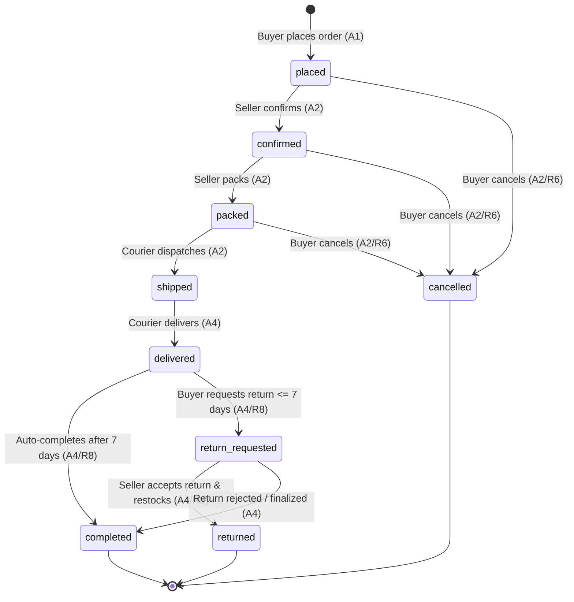

# WearHub Architecture & Data Design Decisions

This document records the architectural, data modeling, and integrity decisions for WearHub. Every design decision traces directly to the testable requirements (**R1**–**R10**) and core actions (**A1**–**A5**).

---

## 1. Normalisation & Deliberate Denormalisations

### 1.1 Base Relational Normalisation (3NF)
WearHub adheres to Third Normal Form (3NF) for its core entities. Each non-key attribute depends solely on the primary key:
- Garment base metadata (title, description, seller ownership) lives only in `products`.
- Specific physical attributes (size, colour, SKU, active catalog price, stock) live only in `product_variants` (**R1**).
- Taxonomy categorisation is isolated to the join table `product_categories`.

### 1.2 Deliberate Denormalisations

| Denormalised Field(s) | Table | Target Requirement | Decision & Rationale | Integrity Enforcement Mechanism |
| :--- | :--- | :--- | :--- | :--- |
| `unit_price_minor`, `product_name_snapshot`, `size_snapshot`, `colour_snapshot` | `order_items` | **R3 [A1]** | **Receipt Immutability**: An order is a legal contract. If a seller later edits a product title or updates variant prices, historical buyer receipts must remain immutable. | Copied atomically inside the checkout transaction (`INSERT ... SELECT`). |
| `subtotal_minor` | `orders` | **R3, R4 [A1]** | **Query Latency**: Allows instant retrieval of order totals without joining and summing child items on every read. | **Deferred Constraint Trigger**: `trg_orders_subtotal_matches` and `trg_order_items_subtotal_matches` verify `orders.subtotal_minor = SUM(order_items.line_total_minor)` at transaction `COMMIT`. Raises `order_subtotal_mismatch` if invalid. |
| `rating_avg_x100`, `rating_count` | `products` | **R10 [A5]** | **High-Throughput Catalog Browsing**: Eliminates costly table-scan aggregates (`AVG(stars)`, `COUNT(*)`) when rendering category feeds and product cards. | **Aggregate Sync Trigger**: `trg_reviews_sync_product_rating` recalculates and updates the cached count and average integer whenever a review is inserted, updated, or soft-deleted. |
| `seller_id`, `product_id` | `product_variants`, `order_items`, `reviews` | **R4 [A1], R10 [A5]** | **Database-Enforced Multi-Tenant Integrity**: Redundant foreign keys enable composite foreign key constraints. The database engine mathematically guarantees that all items in an order belong to the same seller as the order header. | **Composite Foreign Keys**: `fk_order_items_order_seller` and `fk_order_items_variant_seller` prove item-to-order seller alignment. |

---

## 2. Money & Currency Design

### 2.1 The Money Rule
- **No Floating Point / Decimals**: Financial calculations never use `FLOAT`, `DOUBLE`, `REAL`, or `NUMERIC`.
- **Minor Units (`bigint`)**: All monetary values are stored as 64-bit integers in minor currency units (Nigerian Kobo: 1 NGN = 100 Kobo).
- **Explicit Currency (`char(3)`)**: Every row containing a money amount must store the ISO-4217 uppercase currency code (`'NGN'`).

### 2.2 Inventory of Money Columns
- `product_variants.price_minor` & `product_variants.currency` (**R1**)
- `order_items.unit_price_minor` & `order_items.currency` (**R3**)
- `order_items.line_total_minor` (**R3**)
- `orders.subtotal_minor` & `orders.currency` (**R3, R4**)
- `orders.delivery_fee_minor` (**R4**)
- `orders.total_minor` (**R4**)

### 2.3 Generated Columns
- `order_items.line_total_minor`: Defined as `GENERATED ALWAYS AS (quantity * unit_price_minor) STORED`.
- `orders.total_minor`: Defined as `GENERATED ALWAYS AS (subtotal_minor + delivery_fee_minor) STORED`.
- **Rationale**: Stored generated columns eliminate rounding errors, arithmetic drift, and client-side calculation bugs. The database engine guarantees line totals and grand totals are always mathematically exact.

---

## 3. Order Status & State Machine

### 3.1 State Diagram

### Visual Diagram

### 3.2 Allowed Transitions (Exact 11 Rows)

| From Status | To Status | Triggered By | Requirement | Business Meaning |
| :--- | :--- | :--- | :--- | :--- |
| `placed` | `confirmed` | Seller | **A2** | Seller accepts and acknowledges the incoming order. |
| `placed` | `cancelled` | Buyer / Seller | **R6 [A2]** | Order cancelled prior to processing; stock released (**R9**). |
| `confirmed` | `packed` | Seller | **A2** | Garment picked, folded, and boxed for courier pickup. |
| `confirmed` | `cancelled` | Buyer / Seller | **R6 [A2]** | Order cancelled before dispatch; stock released (**R9**). |
| `packed` | `shipped` | Seller | **A2** | Handed over to logistics courier for delivery in Lagos. |
| `packed` | `cancelled` | Buyer / Seller | **R6 [A2]** | Last point of cancellation before courier handover (**R9**). |
| `shipped` | `delivered` | Courier / System | **A4** | Buyer receives parcel and pays on delivery. |
| `delivered` | `completed` | System (Worker) | **R8 [A4]** | 7-day return window elapses without return request; sale finalized. |
| `delivered` | `return_requested` | Buyer | **R8 [A4]** | Buyer logs a return request within the 7-day return window. |
| `return_requested` | `returned` | Seller / Admin | **R9 [A4]** | Garment received back in good condition; restocked. |
| `return_requested` | `completed` | Seller / Admin | **A4** | Return rejected (e.g. damaged/worn item); sale finalized. |

### 3.3 Forbidden Transitions & Rationales

| Forbidden Transition | Business & System Rationale | Requirement |
| :--- | :--- | :--- |
| `shipped` -> `cancelled` | The physical clothing has departed the seller boutique. Cancelling would break real-world logistics tracking and risk loss of goods. The buyer must receive the item and initiate a return. | **R6 [A2]** |
| `completed` -> `return_requested` | `completed` explicitly signals that the 7-day statutory return window has expired. Allowing returns after completion violates seller finality. | **R8 [A4]** |
| `delivered` -> `cancelled` | The buyer is in physical possession of the garment and paid cash on delivery. Cancelling an already-delivered order erases a legitimate completed transaction. | **R6, R8 [A4]** |
| `cancelled` -> Any status | Terminal state. Cancelled orders cannot be resurrected; stock has already been restored. | **R6, R9** |
| `returned` -> Any status | Terminal state. Goods have been inspected and returned to inventory. | **R9** |
| Any backwards jump (e.g. `shipped` -> `packed`) | Order fulfillment is unidirectional to preserve delivery tracking integrity. | **A2, A3** |

### 3.4 Multi-Layer Enforcement Mechanism
1. **PostgreSQL Enum**: Type `order_status` defines the strict set of valid status tokens.
2. **Transition Matrix Table**: `order_status_transitions` stores the 11 legal pairs.
3. **Database Trigger**: `trg_orders_enforce_transition` validates `(OLD.status, NEW.status)` against `order_status_transitions`. If not found, it raises exception `order_transition_illegal`.
4. **Conditional API Updates**: Application endpoints execute atomic conditional updates: `UPDATE orders SET status = :new_status, updated_at = now() WHERE id = :id AND status = :expected_current_status`.

---

## 4. Time, Retention & Privacy Lifecycle

### 4.1 Timestamp Policy
Every table without exception contains:
- `created_at timestamptz NOT NULL DEFAULT now()`
- `updated_at timestamptz NOT NULL DEFAULT now()` (maintained automatically via trigger `trg_set_updated_at`).

### 4.2 Deletion & Retention Matrix

| Table | Strategy | Rationale & Legal Compliance |
| :--- | :--- | :--- |
| `buyers` | **Soft Delete + PII Anonymisation** | Under the **Nigeria Data Protection Act (NDPA)**, a user has the right to account erasure. To balance GDPR/NDPA privacy rights with statutory tax retention, deleting a buyer anonymises PII (`full_name = 'Deleted User'`, `email = 'deleted_buyer_uuid@anonymized.local'`, `phone = NULL`, `delivery_address = NULL`) and sets `deleted_at = now()`, while preserving foreign keys for financial records. |
| `sellers` | **Soft Delete** (`deleted_at`) | Boutiques closing their shop set `deleted_at`. Catalog listings are deactivated while past sales ledgers remain fully auditable. |
| `categories` | **Hard Delete (Restricted)** | Controlled directly by admins. `ON DELETE RESTRICT` prevents deletion of categories actively linked to products. |
| `products` | **Soft Delete** (`deleted_at`) | Discontinued garments set `deleted_at` so active listings hide them while historical buyer order line items still reference them. |
| `product_categories` | **Hard Delete** | Join table rows are removed when catalog categories are reorganised. |
| `product_variants` | **Soft Delete** (`deleted_at`) | Retires individual size/colour variants without breaking foreign keys from existing orders. |
| `orders` | **NEVER Deleted** | **Immutable Financial Contract**: Commercial and tax laws mandate permanent retention of completed/cancelled order headers. |
| `order_items` | **NEVER Deleted** | **Immutable Financial Line Items**: Receipts must be preserved permanently. |
| `order_status_transitions` | **NEVER Deleted** | Static configuration table. |
| `order_status_history` | **NEVER Deleted** | **Immutable Audit Log**: Security and dispute resolution require an untampered history of lifecycle events. |
| `reviews` | **Soft Delete** (`deleted_at`) | Enables moderation removal of offensive or fraudulent reviews while preserving star recalculation auditability. |

---

## 5. Identifier Strategy & Security

### 5.1 UUIDv4 Selection
All primary keys use `uuid DEFAULT gen_random_uuid()`. Sequential IDs (`SERIAL`, `BIGSERIAL`, `AUTO_INCREMENT`) are strictly forbidden.

### 5.2 Security Threats Mitigated
1. **Enumeration / IDOR Attacks**: Sequential IDs allow malicious scrapers to iterate endpoints (e.g. `/v1/orders/1001`, `/v1/orders/1002`) to harvest buyer addresses, phone numbers, and purchase details. UUIDv4 provides 122 bits of cryptographic entropy, rendering brute-force guessing impossible.
2. **Business Intelligence Leakage**: Sequential IDs reveal exact sales metrics, daily transaction volumes, and growth velocities to competitors and rival merchants. UUIDs leak zero platform metrics.

---

## 6. Constraints & Defensive Integrity

### 6.1 Constraint Reference

| Table | Constraint Name | Constraint Type | Definition / Target |
| :--- | :--- | :--- | :--- |
| `buyers` | `uq_buyers_email` | UNIQUE | `email` |
| `buyers` | `uq_buyers_phone` | UNIQUE | `phone` |
| `sellers` | `uq_sellers_shop_name` | UNIQUE | `shop_name` |
| `sellers` | `uq_sellers_email` | UNIQUE | `email` |
| `categories` | `uq_categories_name` | UNIQUE | `name` |
| `categories` | `uq_categories_slug` | UNIQUE | `slug` |
| `products` | `fk_products_seller` | FOREIGN KEY | `seller_id REFERENCES sellers(id)` |
| `products` | `uq_products_id_seller` | UNIQUE | `(id, seller_id)` |
| `product_categories` | `pk_product_categories` | PRIMARY KEY | `(product_id, category_id)` |
| `product_variants` | `ck_product_variants_stock_nonneg` | CHECK | `stock_quantity >= 0` |
| `product_variants` | `ck_product_variants_price_positive`| CHECK | `price_minor > 0` |
| `product_variants` | `ck_product_variants_currency_upper`| CHECK | `currency ~ '^[A-Z]{3}$'` |
| `product_variants` | `uq_product_variants_product_size_colour` | UNIQUE | `(product_id, size, colour)` |
| `product_variants` | `uq_product_variants_sku` | UNIQUE | `sku` |
| `product_variants` | `uq_product_variants_composite` | UNIQUE | `(id, seller_id, product_id, price_minor, currency)` |
| `orders` | `fk_orders_buyer` | FOREIGN KEY | `buyer_id REFERENCES buyers(id)` |
| `orders` | `fk_orders_seller` | FOREIGN KEY | `seller_id REFERENCES sellers(id)` |
| `orders` | `ck_orders_currency_upper` | CHECK | `currency ~ '^[A-Z]{3}$'` |
| `orders` | `uq_orders_composite_review` | UNIQUE | `(id, buyer_id, status)` |
| `orders` | `uq_orders_composite_item` | UNIQUE | `(id, seller_id)` |
| `order_items` | `uq_order_items_order_variant` | UNIQUE | `(order_id, variant_id)` |
| `order_items` | `ck_order_items_quantity_positive` | CHECK | `quantity > 0` |
| `order_items` | `ck_order_items_unit_price_positive`| CHECK | `unit_price_minor > 0` |
| `order_items` | `ck_order_items_currency_upper` | CHECK | `currency ~ '^[A-Z]{3}$'` |
| `order_items` | `fk_order_items_order_seller` | FOREIGN KEY | `(order_id, seller_id) REFERENCES orders(id, seller_id)` |
| `order_items` | `fk_order_items_variant_seller` | FOREIGN KEY | `(variant_id, seller_id, product_id, unit_price_minor, currency) REFERENCES product_variants(id, seller_id, product_id, price_minor, currency)` |
| `reviews` | `uq_reviews_order_item` | UNIQUE | `order_item_id` |
| `reviews` | `fk_reviews_order_completed` | FOREIGN KEY | `(order_id, buyer_id, order_status) REFERENCES orders(id, buyer_id, status)` |
| `reviews` | `ck_reviews_order_status_completed` | CHECK | `order_status = 'completed'` |
| `reviews` | `ck_reviews_stars` | CHECK | `stars BETWEEN 1 AND 5` |

### 6.2 Invalid State Defense Matrix

| Invalid State | Constraint / Defense Mechanism Blocking It | Result / Behavior |
| :--- | :--- | :--- |
| Last item sold twice under concurrency | Conditional update: `UPDATE product_variants SET stock_quantity = stock_quantity - :qty WHERE id = :id AND stock_quantity >= :qty` + `ck_product_variants_stock_nonneg` | Zero rows updated; API returns HTTP 409 `OUT_OF_STOCK`. |
| Negative stock quantity | `ck_product_variants_stock_nonneg` | Database rejects update with check constraint violation. |
| Duplicate size + colour for one product | `uq_product_variants_product_size_colour` | Database rejects duplicate variant insert. |
| An order mixing items from two sellers | `fk_order_items_variant_seller` & `fk_order_items_order_seller` | Database rejects line item insert if variant seller != order seller. |
| Subtotal doesn't match sum of items | `trg_orders_subtotal_matches` & `trg_order_items_subtotal_matches` | Deferred trigger raises `order_subtotal_mismatch` at `COMMIT`. |
| Review submitted before order completion | `fk_reviews_order_completed` & `ck_reviews_order_status_completed` | Database rejects foreign key / check constraint if status != 'completed'. |
| Two reviews for one order item | `uq_reviews_order_item` | Database rejects duplicate review insert. |
| Order item quantity = 0 | `ck_order_items_quantity_positive` | Database rejects insert with check constraint violation. |
| Negative or zero price | `ck_product_variants_price_positive`, `ck_order_items_unit_price_positive` | Database rejects insert with check constraint violation. |
| Lowercase currency (`ngn`) | `ck_product_variants_currency_upper`, `ck_orders_currency_upper`, `ck_order_items_currency_upper` | Database rejects check constraint violation. |
| Shipped order cancelled directly | `trg_orders_enforce_transition` | Trigger aborts update with error `order_transition_illegal`. |

---

## 7. Indexing Strategy for Core Actions (A1–A5)

Only indexes serving named queries across **A1**–**A5** are created. Redundant and speculative indexes are strictly omitted.

| Action & Query | Index Name | Table & Columns | Type / Predicate | Rationale & Query Plan Goal |
| :--- | :--- | :--- | :--- | :--- |
| **A1 Browse Category** | `idx_product_categories_category` | `product_categories (category_id, product_id)` | B-Tree | Index-only scan to fetch all active product IDs in a category without scanning full product catalog. |
| **A2 Seller Open Orders** | `idx_orders_seller_open` | `orders (seller_id, placed_at)` | Partial B-Tree: `WHERE status IN ('placed', 'confirmed', 'packed')` | Provides immediate index scan of pending orders requiring fulfillment, ignoring millions of historical completed orders. |
| **A3 Live Order Tracking** | `idx_order_status_history_order` | `order_status_history (order_id, created_at)` | B-Tree | Fetches full chronological audit trail of status updates for the tracking timeline. |
| **A4 Buyer Order History** | `idx_orders_buyer_placed` | `orders (buyer_id, placed_at DESC, id DESC)` | B-Tree | Supports keyset pagination for buyer order history sorted newest first (**R5**). |
| **A4 Auto-Complete Worker** | `idx_orders_delivered` | `orders (delivered_at)` | Partial B-Tree: `WHERE status = 'delivered'` | Enables the 7-day auto-complete background worker to immediately find delivered orders where `delivered_at <= now() - interval '7 days'`. |
| **A5 Product Reviews** | `idx_reviews_product_created` | `reviews (product_id, created_at DESC)` | B-Tree | Serves paginated product review lists sorted newest first on garment detail pages. |

### 7.1 What Is Deliberately NOT Indexed
1. **Unfiltered `orders.status`**: Low cardinality column (9 enum values). A full index would be ignored by the query planner and cause heavy write amplification during status updates.
2. **Text Descriptions / Snapshots (`products.description`, `orders.delivery_address_snapshot`)**: Large text columns are never used in query equality or sorting; indexing them would bloat disk footprint.
3. **`created_at` / `updated_at` on Static Reference Tables**: Tables such as `categories` and `order_status_transitions` are small tables (< 100 rows) scanned sequentially in cache.
