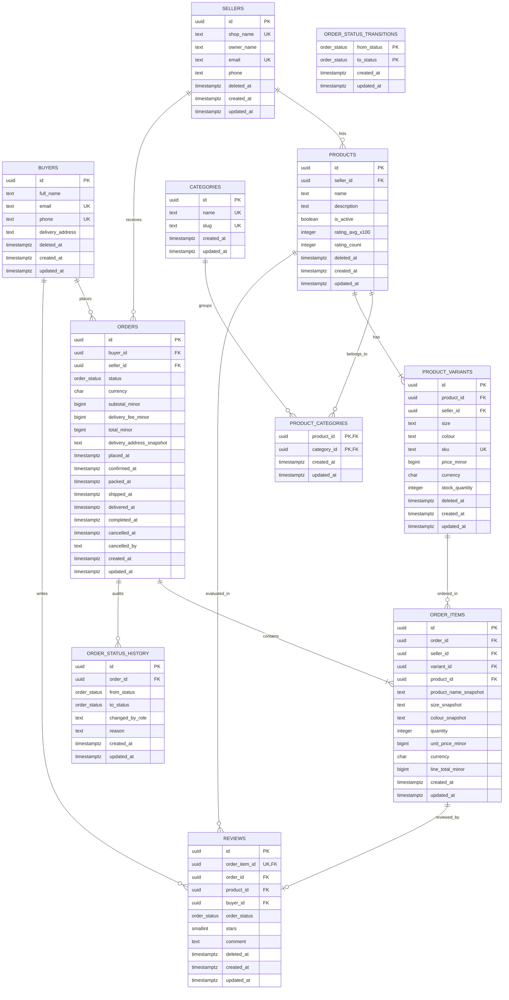
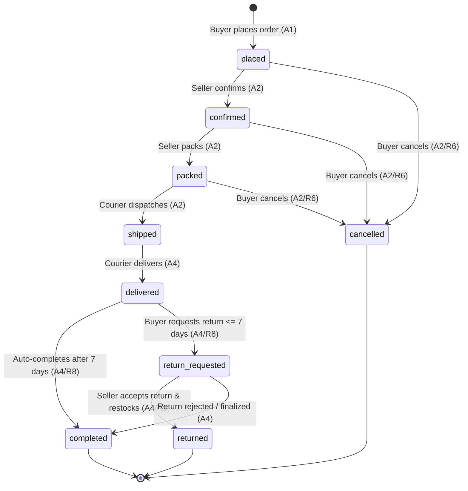

# WearHub System Design & Database Architecture — Final Specification

---

## Table of Contents
- [1. Requirements & System Scope](#1-requirements--system-scope)
  - [1.1 What WearHub Does](#11-what-wearhub-does)
  - [1.2 User Roles](#12-user-roles)
  - [1.3 Core Actions (A1–A5)](#13-core-actions-a1a5)
  - [1.4 Functional Requirements (R1–R10)](#14-functional-requirements-r1r10)
  - [1.5 Non-Goals](#15-non-goals)
- [2. Relational Data Model & Architecture](#2-relational-data-model--architecture)
  - [2.1 Entity Definitions (11 Tables)](#21-entity-definitions-11-tables)
  - [2.2 Relationships & Cardinality](#22-relationships--cardinality)
  - [2.3 Entity-Relationship Diagram](#23-entity-relationship-diagram)
- [3. Design Decisions & Defensive Integrity](#3-design-decisions--defensive-integrity)
  - [3.1 Normalisation & Deliberate Denormalisations](#31-normalisation--deliberate-denormalisations)
  - [3.2 Money & Currency Design](#32-money--currency-design)
  - [3.3 Order Status & State Machine](#33-order-status--state-machine)
  - [3.4 Time, Retention & Privacy Lifecycle](#34-time-retention--privacy-lifecycle)
  - [3.5 Identifier Strategy & Security](#35-identifier-strategy--security)
  - [3.6 Constraints & Defensive Integrity](#36-constraints--defensive-integrity)
  - [3.7 Indexing Strategy for Core Actions](#37-indexing-strategy-for-core-actions)
- [4. REST API Specification & Real-Time Protocol](#4-rest-api-specification--real-time-protocol)
  - [4.1 Global Conventions & Standards](#41-global-conventions--standards)
  - [4.2 Core Action Contracts (A1–A5)](#42-core-action-contracts-a1a5)
  - [4.3 Resource Management & Administration Endpoints](#43-resource-management--administration-endpoints)
  - [4.4 API Architectural Analysis: Over-Fetching & Technology Choice](#44-api-architectural-analysis-over-fetching--technology-choice)
  - [4.5 Real-Time Communication Architecture: SSE vs WebSockets](#45-real-time-communication-architecture-sse-vs-websockets)
- [5. Performance Verification & Defensive Proof](#5-performance-verification--defensive-proof)
  - [5.1 Query Execution Plans (Q1–Q5)](#51-query-execution-plans-q1q5)
  - [5.2 Proof of Database Defense (Rejected Invalid Operations)](#52-proof-of-database-defense-rejected-invalid-operations)
- [6. Compliance & Evidence Checklist](#6-compliance--evidence-checklist)

---

## 1. Requirements & System Scope

### 1.1 What WearHub Does
WearHub is a ready-to-wear fashion marketplace based in Lagos, Nigeria (currency NGN). Fashion brands and boutiques (sellers) list clothes in fixed sizes and colours, while shoppers (buyers) browse inventory, place orders, track delivery in real time, and pay cash on delivery.

### 1.2 User Roles
- **Buyer**: Needs to browse ready-to-wear clothing in specific sizes/colours, place orders with locked prices, track fulfillment live, pay on delivery, and review completed purchases.
- **Seller**: Needs to list products with size/colour variants and stock, receive seller-specific orders, update fulfillment states (confirm, pack, ship), and process returns.
- **Admin**: Needs to oversee platform activity, manage taxonomy/categories, monitor order transitions, and maintain dispute resolution standards.

### 1.3 Core Actions (A1–A5)
- **A1**: A buyer places an order for items in a chosen size and colour. Stock is reserved and prices are locked.
- **A2**: The seller confirms, packs and ships the order.
- **A3**: The buyer tracks the order live.
- **A4**: The order is delivered, then completed (or the buyer requests a return within 7 days).
- **A5**: The buyer reviews an item from a completed order.

### 1.4 Functional Requirements (R1–R10)
- **R1 [A1] - Variant Stock Availability**: A buyer selects items by specific size and colour; variants with zero stock quantity cannot be ordered.
- **R2 [A1] - Concurrency & Oversell Protection**: The last item in stock is sold exactly once under concurrent order attempts using atomic conditional decrement.
- **R3 [A1] - Price & Detail Snapshots**: Unit prices, product names, sizes, and colours are locked and snapshot into the order item at checkout; future seller catalog edits do not alter existing orders.
- **R4 [A1] - Single-Seller Orders**: Each order belongs to exactly one seller; checking out items from multiple sellers splits the cart into distinct orders per seller.
- **R5 [A1, A3] - Order History**: Buyers can view their order history sorted in descending chronological order (newest first).
- **R6 [A2, A4] - Buyer Cancellation**: A buyer can cancel an order while it is in `placed`, `confirmed`, or `packed` state; cancellation is strictly forbidden once marked `shipped`.
- **R7 [A3] - Real-Time Tracking**: Buyers receive live status updates via Server-Sent Events (SSE) as orders transition across states.
- **R8 [A4] - Return Window & Auto-Completion**: After an order is `delivered`, a buyer has exactly 7 days to request a return (`return_requested`); if no return is requested within 7 days, the order automatically transitions to `completed`.
- **R9 [A2, A4] - Stock Restocking**: Cancelled orders and accepted returns (`returned`) automatically restore reserved quantities back into active variant stock.
- **R10 [A5] - Verified Purchase Reviews**: A buyer can submit exactly one review per order item (rated 1 to 5 stars) only after the parent order reaches `completed` status.

### 1.5 Non-Goals
- **No Online Payment Processing**: All orders use pay on delivery; the platform records monetary amounts in NGN minor units (kobo) without third-party payment gateways.
- **No Made-to-Measure Clothing**: Only fixed, pre-defined size and colour variants are supported.
- **No Native Mobile Application**: Scope is constrained to backend REST API design and PostgreSQL data modeling.
- **No In-App Chat**: No direct messaging between buyers and sellers is supported.

---

## 2. Relational Data Model & Architecture

### 2.1 Entity Definitions (11 Tables)

#### 2.1.1 `buyers`
Registered retail customers in Lagos who browse products, place orders, and submit reviews.
- **Identifier**: `id uuid DEFAULT gen_random_uuid() PRIMARY KEY`
- **Soft Deletion**: Supported via `deleted_at` for account deactivation while preserving order history.

| Field | Postgres Type | Required | Notes |
| :--- | :--- | :--- | :--- |
| `id` | `uuid` | Yes | Primary key (`pk_buyers`), generated default UUIDv4. |
| `full_name` | `text` | Yes | Buyer full name. |
| `email` | `text` | Yes | Unique login/contact email (`uq_buyers_email`). |
| `phone` | `text` | Yes | Unique phone number for delivery contact (`uq_buyers_phone`). |
| `delivery_address` | `text` | Yes | Default shipping address in Lagos. |
| `deleted_at` | `timestamptz` | No | Soft delete timestamp; null for active accounts. |
| `created_at` | `timestamptz` | Yes | Record creation timestamp (`DEFAULT now()`). |
| `updated_at` | `timestamptz` | Yes | Record update timestamp (`DEFAULT now()`). |

#### 2.1.2 `sellers`
Fashion brands and boutiques that list ready-to-wear garments and fulfill customer orders.
- **Identifier**: `id uuid DEFAULT gen_random_uuid() PRIMARY KEY`
- **Soft Deletion**: Supported via `deleted_at` for shop deactivation without deleting past sales records.

| Field | Postgres Type | Required | Notes |
| :--- | :--- | :--- | :--- |
| `id` | `uuid` | Yes | Primary key (`pk_sellers`), generated default UUIDv4. |
| `shop_name` | `text` | Yes | Unique boutique brand name (`uq_sellers_shop_name`). |
| `owner_name` | `text` | Yes | Legal business owner or representative. |
| `email` | `text` | Yes | Unique merchant contact email (`uq_sellers_email`). |
| `phone` | `text` | Yes | Merchant business phone number. |
| `deleted_at` | `timestamptz` | No | Soft delete timestamp; null for active sellers. |
| `created_at` | `timestamptz` | Yes | Record creation timestamp (`DEFAULT now()`). |
| `updated_at` | `timestamptz` | Yes | Record update timestamp (`DEFAULT now()`). |

#### 2.1.3 `categories`
Curated fashion taxonomy used to organize and filter garment listings.
- **Identifier**: `id uuid DEFAULT gen_random_uuid() PRIMARY KEY`
- **Soft Deletion**: Not soft-deleted; platform-wide taxonomy records are managed directly by admins.

| Field | Postgres Type | Required | Notes |
| :--- | :--- | :--- | :--- |
| `id` | `uuid` | Yes | Primary key (`pk_categories`), generated default UUIDv4. |
| `name` | `text` | Yes | Category display name (`uq_categories_name`). |
| `slug` | `text` | Yes | URL-friendly unique slug (`uq_categories_slug`). |
| `created_at` | `timestamptz` | Yes | Record creation timestamp (`DEFAULT now()`). |
| `updated_at` | `timestamptz` | Yes | Record update timestamp (`DEFAULT now()`). |

#### 2.1.4 `products`
Ready-to-wear clothing catalog items created by sellers.
- **Identifier**: `id uuid DEFAULT gen_random_uuid() PRIMARY KEY`
- **Composite Unique**: `(id, seller_id)` (`uq_products_id_seller`) to enable composite foreign key checks.
- **Soft Deletion**: Supported via `deleted_at` for archiving discontinued items.

| Field | Postgres Type | Required | Notes |
| :--- | :--- | :--- | :--- |
| `id` | `uuid` | Yes | Primary key (`pk_products`), generated default UUIDv4. |
| `seller_id` | `uuid` | Yes | Foreign key to `sellers(id)` (`fk_products_seller`). |
| `name` | `text` | Yes | Garment title. |
| `description` | `text` | Yes | Fabric details, care instructions, and styling notes. |
| `is_active` | `boolean` | Yes | Visibility flag (`DEFAULT true`). |
| `rating_avg_x100` | `integer` | Yes | Cached average rating x100 (e.g. 450 = 4.50 stars, `DEFAULT 0`). |
| `rating_count` | `integer` | Yes | Cached total count of approved reviews (`DEFAULT 0`). |
| `deleted_at` | `timestamptz` | No | Soft delete timestamp. |
| `created_at` | `timestamptz` | Yes | Record creation timestamp (`DEFAULT now()`). |
| `updated_at` | `timestamptz` | Yes | Record update timestamp (`DEFAULT now()`). |

#### 2.1.5 `product_categories`
Many-to-many join table linking products to one or more taxonomy categories.
- **Identifier**: Composite Primary Key `(product_id, category_id)` (`pk_product_categories`).
- **Soft Deletion**: Not soft-deleted; associations are removed on catalog reorganization.

| Field | Postgres Type | Required | Notes |
| :--- | :--- | :--- | :--- |
| `product_id` | `uuid` | Yes | Foreign key to `products(id)` ON DELETE CASCADE (`fk_product_categories_product`). |
| `category_id` | `uuid` | Yes | Foreign key to `categories(id)` ON DELETE RESTRICT (`fk_product_categories_category`). |
| `created_at` | `timestamptz` | Yes | Record creation timestamp (`DEFAULT now()`). |
| `updated_at` | `timestamptz` | Yes | Record update timestamp (`DEFAULT now()`). |

#### 2.1.6 `product_variants`
Specific stock-keeping units defining a unique size and colour option with dedicated inventory and price.
- **Identifier**: `id uuid DEFAULT gen_random_uuid() PRIMARY KEY`
- **Constraints**:
  - `uq_product_variants_product_size_colour`: `UNIQUE (product_id, size, colour)`
  - `uq_product_variants_sku`: `UNIQUE (sku)`
  - `ck_product_variants_stock_nonneg`: `CHECK (stock_quantity >= 0)`
  - `uq_product_variants_composite`: `UNIQUE (id, seller_id, product_id, price_minor, currency)`
- **Soft Deletion**: Supported via `deleted_at` when retiring specific size/colour variants.

| Field | Postgres Type | Required | Notes |
| :--- | :--- | :--- | :--- |
| `id` | `uuid` | Yes | Primary key (`pk_product_variants`), generated default UUIDv4. |
| `product_id` | `uuid` | Yes | Foreign key to `products(id)` (`fk_product_variants_product`). |
| `seller_id` | `uuid` | Yes | Denormalised foreign key to `sellers(id)` (`fk_product_variants_seller`). |
| `size` | `text` | Yes | Garment size (e.g., S, M, L, XL, UK 10). |
| `colour` | `text` | Yes | Garment colour (e.g., Black, Indigo, Olive). |
| `sku` | `text` | Yes | Unique stock keeping unit code (`uq_product_variants_sku`). |
| `price_minor` | `bigint` | Yes | Unit price in kobo (e.g. 2500000 = 25,000 NGN). |
| `currency` | `char(3)` | Yes | Currency code (`DEFAULT 'NGN'`). |
| `stock_quantity` | `integer` | Yes | Available stock; must be non-negative (`ck_product_variants_stock_nonneg`). |
| `deleted_at` | `timestamptz` | No | Soft delete timestamp. |
| `created_at` | `timestamptz` | Yes | Record creation timestamp (`DEFAULT now()`). |
| `updated_at` | `timestamptz` | Yes | Record update timestamp (`DEFAULT now()`). |

#### 2.1.7 `orders`
A purchase contract placed by a buyer with a single seller, payable on delivery.
- **Identifier**: `id uuid DEFAULT gen_random_uuid() PRIMARY KEY`
- **Constraints**:
  - Composite key for reviews/items: `UNIQUE (id, buyer_id, status)` and `UNIQUE (id, seller_id)`
- **Deletion Policy**: **NEVER deleted**. Orders are permanent financial and audit legal records.

| Field | Postgres Type | Required | Notes |
| :--- | :--- | :--- | :--- |
| `id` | `uuid` | Yes | Primary key (`pk_orders`), generated default UUIDv4. |
| `buyer_id` | `uuid` | Yes | Foreign key to `buyers(id)` (`fk_orders_buyer`). |
| `seller_id` | `uuid` | Yes | Foreign key to `sellers(id)` (`fk_orders_seller`). |
| `status` | `order_status` | Yes | Enum (`placed`, `confirmed`, `packed`, `shipped`, `delivered`, `completed`, `cancelled`, `return_requested`, `returned`). |
| `currency` | `char(3)` | Yes | Currency code (`DEFAULT 'NGN'`). |
| `subtotal_minor` | `bigint` | Yes | Sum of line totals in kobo; verified by trigger `trg_orders_subtotal_matches`. |
| `delivery_fee_minor` | `bigint` | Yes | Fixed delivery fee in kobo. |
| `total_minor` | `bigint` | Yes | Generated column: `GENERATED ALWAYS AS (subtotal_minor + delivery_fee_minor) STORED`. |
| `delivery_address_snapshot` | `text` | Yes | Immutable copy of delivery address at checkout. |
| `placed_at` | `timestamptz` | Yes | Timestamp order placed (`DEFAULT now()`). |
| `confirmed_at` | `timestamptz` | No | Timestamp seller confirmed order. |
| `packed_at` | `timestamptz` | No | Timestamp seller packed package. |
| `shipped_at` | `timestamptz` | No | Timestamp courier departed with package. |
| `delivered_at` | `timestamptz` | No | Timestamp package received by buyer. |
| `completed_at` | `timestamptz` | No | Timestamp finalized (7 days post-delivery or after return resolution). |
| `cancelled_at` | `timestamptz` | No | Timestamp order was cancelled. |
| `cancelled_by` | `text` | No | Role that cancelled the order (`'buyer'`, `'seller'`, `'admin'`). |
| `created_at` | `timestamptz` | Yes | Record creation timestamp (`DEFAULT now()`). |
| `updated_at` | `timestamptz` | Yes | Record update timestamp (`DEFAULT now()`). |

#### 2.1.8 `order_items`
Immutable line items connecting an order to a purchased variant with price and item attribute snapshots.
- **Identifier**: `id uuid DEFAULT gen_random_uuid() PRIMARY KEY`
- **Constraints**:
  - `uq_order_items_order_variant`: `UNIQUE (order_id, variant_id)`
  - `ck_order_items_quantity_positive`: `CHECK (quantity > 0)`
  - `fk_order_items_order_seller`: Composite FK `(order_id, seller_id)` to `orders(id, seller_id)`
  - `fk_order_items_variant_seller`: Composite FK `(variant_id, seller_id, product_id, unit_price_minor, currency)` to `product_variants(id, seller_id, product_id, price_minor, currency)`
- **Deletion Policy**: **NEVER deleted**. Line items are immutable financial ledger lines.

| Field | Postgres Type | Required | Notes |
| :--- | :--- | :--- | :--- |
| `id` | `uuid` | Yes | Primary key (`pk_order_items`), generated default UUIDv4. |
| `order_id` | `uuid` | Yes | Foreign key to `orders(id)` (`fk_order_items_order`). |
| `seller_id` | `uuid` | Yes | Denormalised seller ID to enforce single-seller integrity. |
| `variant_id` | `uuid` | Yes | Foreign key to `product_variants(id)` (`fk_order_items_variant`). |
| `product_id` | `uuid` | Yes | Denormalised foreign key to `products(id)`. |
| `product_name_snapshot` | `text` | Yes | Locked product title at time of order. |
| `size_snapshot` | `text` | Yes | Locked size name at time of order. |
| `colour_snapshot` | `text` | Yes | Locked colour name at time of order. |
| `quantity` | `integer` | Yes | Number of units purchased (`CHECK (quantity > 0)`). |
| `unit_price_minor` | `bigint` | Yes | Locked unit price in kobo at time of order. |
| `currency` | `char(3)` | Yes | Currency code (`DEFAULT 'NGN'`). |
| `line_total_minor` | `bigint` | Yes | Generated column: `GENERATED ALWAYS AS (quantity * unit_price_minor) STORED`. |
| `created_at` | `timestamptz` | Yes | Record creation timestamp (`DEFAULT now()`). |
| `updated_at` | `timestamptz` | Yes | Record update timestamp (`DEFAULT now()`). |

#### 2.1.9 `order_status_transitions`
Reference state machine table defining the 11 legal state transitions for orders.
- **Identifier**: Composite Primary Key `(from_status, to_status)` (`pk_order_status_transitions`).
- **Deletion Policy**: Static configuration table; never deleted during runtime.

| Field | Postgres Type | Required | Notes |
| :--- | :--- | :--- | :--- |
| `from_status` | `order_status` | Yes | Starting status enum. |
| `to_status` | `order_status` | Yes | Target status enum. |
| `created_at` | `timestamptz` | Yes | Record creation timestamp (`DEFAULT now()`). |
| `updated_at` | `timestamptz` | Yes | Record update timestamp (`DEFAULT now()`). |

#### 2.1.10 `order_status_history`
Append-only audit log tracking every status transition event for an order.
- **Identifier**: `id uuid DEFAULT gen_random_uuid() PRIMARY KEY`
- **Deletion Policy**: **NEVER deleted**. Immutable security and operations audit log.

| Field | Postgres Type | Required | Notes |
| :--- | :--- | :--- | :--- |
| `id` | `uuid` | Yes | Primary key (`pk_order_status_history`), generated default UUIDv4. |
| `order_id` | `uuid` | Yes | Foreign key to `orders(id)` (`fk_order_status_history_order`). |
| `from_status` | `order_status` | No | Prior status (null upon initial creation). |
| `to_status` | `order_status` | Yes | Destination status. |
| `changed_by_role` | `text` | Yes | Role initiating transition (`'buyer'`, `'seller'`, `'admin'`, `'system'`). |
| `reason` | `text` | No | Optional cancellation/return or transition explanation. |
| `created_at` | `timestamptz` | Yes | Record creation timestamp (`DEFAULT now()`). |
| `updated_at` | `timestamptz` | Yes | Record update timestamp (`DEFAULT now()`). |

#### 2.1.11 `reviews`
Post-purchase product ratings and comments submitted by buyers for completed order items.
- **Identifier**: `id uuid DEFAULT gen_random_uuid() PRIMARY KEY`
- **Constraints**:
  - `uq_reviews_order_item`: `UNIQUE (order_item_id)` (one review per item)
  - `fk_reviews_order_completed`: Composite FK `(order_id, buyer_id, order_status)` to `orders(id, buyer_id, status)`
  - `ck_reviews_order_status_completed`: `CHECK (order_status = 'completed')`
  - `ck_reviews_stars`: `CHECK (stars BETWEEN 1 AND 5)`
- **Soft Deletion**: Supported via `deleted_at` for moderation/removal of abusive content.

| Field | Postgres Type | Required | Notes |
| :--- | :--- | :--- | :--- |
| `id` | `uuid` | Yes | Primary key (`pk_reviews`), generated default UUIDv4. |
| `order_item_id` | `uuid` | Yes | Unique foreign key to `order_items(id)` (`uq_reviews_order_item`). |
| `order_id` | `uuid` | Yes | Foreign key to `orders(id)`. |
| `product_id` | `uuid` | Yes | Foreign key to `products(id)` (`fk_reviews_product`). |
| `buyer_id` | `uuid` | Yes | Foreign key to `buyers(id)` (`fk_reviews_buyer`). |
| `order_status` | `order_status` | Yes | Must equal `'completed'` (`ck_reviews_order_status_completed`). |
| `stars` | `smallint` | Yes | Rating from 1 to 5 (`ck_reviews_stars`). |
| `comment` | `text` | No | Optional text review. |
| `deleted_at` | `timestamptz` | No | Soft delete timestamp. |
| `created_at` | `timestamptz` | Yes | Record creation timestamp (`DEFAULT now()`). |
| `updated_at` | `timestamptz` | Yes | Record update timestamp (`DEFAULT now()`). |

---

### 2.2 Relationships & Cardinality

| Primary Entity | Foreign Entity | Cardinality | Join Mechanism / Table | Requirement & Rationale |
| :--- | :--- | :--- | :--- | :--- |
| **`buyers`** | **`orders`** | One-to-Many | `orders.buyer_id` -> `buyers.id` | **R4, R5**: A buyer can place multiple orders over time and view their chronological order history. |
| **`sellers`** | **`orders`** | One-to-Many | `orders.seller_id` -> `sellers.id` | **R4**: Every order belongs to exactly one seller; checkout across sellers splits orders. |
| **`sellers`** | **`products`** | One-to-Many | `products.seller_id` -> `sellers.id` | **R1**: Sellers list and manage multiple ready-to-wear apparel items. |
| **`products`** | **`categories`** | **Many-to-Many** | **`product_categories`** (`product_id`, `category_id`) | **R1**: A product belongs to multiple taxonomy categories (e.g. "Dresses", "New Arrivals"), and a category contains many products. |
| **`products`** | **`product_variants`** | One-to-Many | `product_variants.product_id` -> `products.id` | **R1, R2**: A garment has multiple physical size and colour combinations with independent stock. |
| **`orders`** | **`product_variants`** | **Many-to-Many** | **`order_items`** (`order_id`, `variant_id`) | **R1, R3, R4**: An order contains multiple garment variants, and a variant appears across multiple buyer orders. |
| **`orders`** | **`order_items`** | One-to-Many | `order_items.order_id` -> `orders.id` | **R3, R4**: An order consists of 1 or more line items locking snapshot unit price and quantity. |
| **`orders`** | **`order_status_history`**| One-to-Many | `order_status_history.order_id` -> `orders.id` | **R6, R7, R8**: Every lifecycle step (confirmed, packed, shipped, delivered, completed, cancelled) is audited. |
| **`order_items`** | **`reviews`** | One-to-One | `reviews.order_item_id` -> `order_items.id` | **R10**: Exactly one verified review per order line item. |
| **`buyers`** | **`reviews`** | One-to-Many | `reviews.buyer_id` -> `buyers.id` | **R10**: A buyer can review multiple purchased items across completed orders. |
| **`products`** | **`reviews`** | One-to-Many | `reviews.product_id` -> `products.id` | **R10**: Aggregate reviews and ratings accumulate under the parent product. |

---

### 2.3 Entity-Relationship Diagram



#### Visual Diagram


---

## 3. Design Decisions & Defensive Integrity

### 3.1 Normalisation & Deliberate Denormalisations

#### 3.1.1 Base Relational Normalisation (3NF)
WearHub adheres to Third Normal Form (3NF) for its core entities. Each non-key attribute depends solely on the primary key:
- Garment base metadata (title, description, seller ownership) lives only in `products`.
- Specific physical attributes (size, colour, SKU, active catalog price, stock) live only in `product_variants` (**R1**).
- Taxonomy categorisation is isolated to the join table `product_categories`.

#### 3.1.2 Deliberate Denormalisations

| Denormalised Field(s) | Table | Target Requirement | Decision & Rationale | Integrity Enforcement Mechanism |
| :--- | :--- | :--- | :--- | :--- |
| `unit_price_minor`, `product_name_snapshot`, `size_snapshot`, `colour_snapshot` | `order_items` | **R3 [A1]** | **Receipt Immutability**: An order is a legal contract. If a seller later edits a product title or updates variant prices, historical buyer receipts must remain immutable. | Copied atomically inside the checkout transaction (`INSERT ... SELECT`). |
| `subtotal_minor` | `orders` | **R3, R4 [A1]** | **Query Latency**: Allows instant retrieval of order totals without joining and summing child items on every read. | **Deferred Constraint Trigger**: `trg_orders_subtotal_matches` and `trg_order_items_subtotal_matches` verify `orders.subtotal_minor = SUM(order_items.line_total_minor)` at transaction `COMMIT`. Raises `order_subtotal_mismatch` if invalid. |
| `rating_avg_x100`, `rating_count` | `products` | **R10 [A5]** | **High-Throughput Catalog Browsing**: Eliminates costly table-scan aggregates (`AVG(stars)`, `COUNT(*)`) when rendering category feeds and product cards. | **Aggregate Sync Trigger**: `trg_reviews_sync_rating` recalculates and updates the cached count and average integer whenever a review is inserted, updated, or soft-deleted. |
| `seller_id`, `product_id` | `product_variants`, `order_items`, `reviews` | **R4 [A1], R10 [A5]** | **Database-Enforced Multi-Tenant Integrity**: Redundant foreign keys enable composite foreign key constraints. The database engine mathematically guarantees that all items in an order belong to the same seller as the order header. | **Composite Foreign Keys**: `fk_order_items_order_seller` and `fk_order_items_variant_seller` prove item-to-order seller alignment. |

---

### 3.2 Money & Currency Design

#### 3.2.1 The Money Rule
- **No Floating Point / Decimals**: Financial calculations never use `FLOAT`, `DOUBLE`, `REAL`, or `NUMERIC`.
- **Minor Units (`bigint`)**: All monetary values are stored as 64-bit integers in minor currency units (Nigerian Kobo: 1 NGN = 100 Kobo).
- **Explicit Currency (`char(3)`)**: Every row containing a money amount must store the ISO-4217 uppercase currency code (`'NGN'`).

#### 3.2.2 Inventory of Money Columns
- `product_variants.price_minor` & `product_variants.currency` (**R1**)
- `order_items.unit_price_minor` & `order_items.currency` (**R3**)
- `order_items.line_total_minor` (**R3**)
- `orders.subtotal_minor` & `orders.currency` (**R3, R4**)
- `orders.delivery_fee_minor` (**R4**)
- `orders.total_minor` (**R4**)

#### 3.2.3 Generated Columns
- `order_items.line_total_minor`: Defined as `GENERATED ALWAYS AS (quantity * unit_price_minor) STORED`.
- `orders.total_minor`: Defined as `GENERATED ALWAYS AS (subtotal_minor + delivery_fee_minor) STORED`.
- **Rationale**: Stored generated columns eliminate rounding errors, arithmetic drift, and client-side calculation bugs. The database engine guarantees line totals and grand totals are always mathematically exact.

---

### 3.3 Order Status & State Machine

#### 3.3.1 State Diagram



#### Visual Diagram


#### 3.3.2 Allowed Transitions (Exact 11 Rows)

| From Status | To Status | Triggered By | Requirement | Business Meaning |
| :--- | :--- | :--- | :--- | :--- |
| `placed` | `confirmed` | Seller | **A2** | Seller accepts and acknowledges the incoming order. |
| `placed` | `cancelled` | Buyer / Seller | **R6 [A2]** | Order cancelled prior to processing; stock released (**R9**). |
| `confirmed` | `packed` | Seller | **A2** | Garment picked, folded, and boxed for courier pickup. |
| `confirmed` | `cancelled` | Buyer / Seller | **R6 [A2]** | Order cancelled before dispatch; stock released (**R9**). |
| `packed` | `shipped` | Seller | **A2** | Handed over to logistics courier for delivery in Lagos. |
| `packed` | `cancelled` | Buyer / Seller | **R6 [A2]** | Last point of cancellation before courier handover (**R9**). |
| `shipped` | `delivered` | Courier / System | **A4** | Buyer receives parcel and pays on delivery. |
| `delivered` | `completed` | System (Worker) | **R8 [A4]** | 7-day return window elapses without return request; sale finalized. |
| `delivered` | `return_requested` | Buyer | **R8 [A4]** | Buyer logs a return request within the 7-day return window. |
| `return_requested` | `returned` | Seller / Admin | **R9 [A4]** | Garment received back in good condition; restocked. |
| `return_requested` | `completed` | Seller / Admin | **A4** | Return rejected (e.g. damaged/worn item); sale finalized. |

#### 3.3.3 Forbidden Transitions & Rationales

| Forbidden Transition | Business & System Rationale | Requirement |
| :--- | :--- | :--- |
| `shipped` -> `cancelled` | The physical clothing has departed the seller boutique. Cancelling would break real-world logistics tracking and risk loss of goods. The buyer must receive the item and initiate a return. | **R6 [A2]** |
| `completed` -> `return_requested` | `completed` explicitly signals that the 7-day statutory return window has expired. Allowing returns after completion violates seller finality. | **R8 [A4]** |
| `delivered` -> `cancelled` | The buyer is in physical possession of the garment and paid cash on delivery. Cancelling an already-delivered order erases a legitimate completed transaction. | **R6, R8 [A4]** |
| `cancelled` -> Any status | Terminal state. Cancelled orders cannot be resurrected; stock has already been restored. | **R6, R9** |
| `returned` -> Any status | Terminal state. Goods have been inspected and returned to inventory. | **R9** |
| Any backwards jump (e.g. `shipped` -> `packed`) | Order fulfillment is unidirectional to preserve delivery tracking integrity. | **A2, A3** |

#### 3.3.4 Multi-Layer Enforcement Mechanism
1. **PostgreSQL Enum**: Type `order_status` defines the strict set of valid status tokens.
2. **Transition Matrix Table**: `order_status_transitions` stores the 11 legal pairs.
3. **Database Trigger**: `trg_orders_enforce_transition` validates `(OLD.status, NEW.status)` against `order_status_transitions`. If not found, it raises exception `order_transition_illegal`.
4. **Conditional API Updates**: Application endpoints execute atomic conditional updates: `UPDATE orders SET status = :new_status, updated_at = now() WHERE id = :id AND status = :expected_current_status`.

---

### 3.4 Time, Retention & Privacy Lifecycle

#### 3.4.1 Timestamp Policy
Every table without exception contains:
- `created_at timestamptz NOT NULL DEFAULT now()`
- `updated_at timestamptz NOT NULL DEFAULT now()` (maintained automatically via trigger `trg_set_updated_at`).

#### 3.4.2 Deletion & Retention Matrix

| Table | Strategy | Rationale & Legal Compliance |
| :--- | :--- | :--- |
| `buyers` | **Soft Delete + PII Anonymisation** | Under the **Nigeria Data Protection Act (NDPA)**, a user has the right to account erasure. To balance GDPR/NDPA privacy rights with statutory tax retention, deleting a buyer anonymises PII (`full_name = 'Deleted User'`, `email = 'deleted_buyer_uuid@anonymized.local'`, `phone = NULL`, `delivery_address = NULL`) and sets `deleted_at = now()`, while preserving foreign keys for financial records. |
| `sellers` | **Soft Delete** (`deleted_at`) | Boutiques closing their shop set `deleted_at`. Catalog listings are deactivated while past sales ledgers remain fully auditable. |
| `categories` | **Hard Delete (Restricted)** | Controlled directly by admins. `ON DELETE RESTRICT` prevents deletion of categories actively linked to products. |
| `products` | **Soft Delete** (`deleted_at`) | Discontinued garments set `deleted_at` so active listings hide them while historical buyer order line items still reference them. |
| `product_categories` | **Hard Delete** | Join table rows are removed when catalog categories are reorganised. |
| `product_variants` | **Soft Delete** (`deleted_at`) | Retires individual size/colour variants without breaking foreign keys from existing orders. |
| `orders` | **NEVER Deleted** | **Immutable Financial Contract**: Commercial and tax laws mandate permanent retention of completed/cancelled order headers. |
| `order_items` | **NEVER Deleted** | **Immutable Financial Line Items**: Receipts must be preserved permanently. |
| `order_status_transitions` | **NEVER Deleted** | Static configuration table. |
| `order_status_history` | **NEVER Deleted** | **Immutable Audit Log**: Security and dispute resolution require an untampered history of lifecycle events. |
| `reviews` | **Soft Delete** (`deleted_at`) | Enables moderation removal of offensive or fraudulent reviews while preserving star recalculation auditability. |

---

### 3.5 Identifier Strategy & Security

#### 3.5.1 UUIDv4 Selection
All primary keys use `uuid DEFAULT gen_random_uuid()`. Sequential IDs (`SERIAL`, `BIGSERIAL`, `AUTO_INCREMENT`) are strictly forbidden.

#### 3.5.2 Security Threats Mitigated
1. **Enumeration / IDOR Attacks**: Sequential IDs allow malicious scrapers to iterate endpoints (e.g. `/v1/orders/1001`, `/v1/orders/1002`) to harvest buyer addresses, phone numbers, and purchase details. UUIDv4 provides 122 bits of cryptographic entropy, rendering brute-force guessing impossible.
2. **Business Intelligence Leakage**: Sequential IDs reveal exact sales metrics, daily transaction volumes, and growth velocities to competitors and rival merchants. UUIDs leak zero platform metrics.

---

### 3.6 Constraints & Defensive Integrity

#### 3.6.1 Constraint Reference

| Table | Constraint Name | Constraint Type | Definition / Target |
| :--- | :--- | :--- | :--- |
| `buyers` | `uq_buyers_email` | UNIQUE | `email` |
| `buyers` | `uq_buyers_phone` | UNIQUE | `phone` |
| `sellers` | `uq_sellers_shop_name` | UNIQUE | `shop_name` |
| `sellers` | `uq_sellers_email` | UNIQUE | `email` |
| `categories` | `uq_categories_name` | UNIQUE | `name` |
| `categories` | `uq_categories_slug` | UNIQUE | `slug` |
| `products` | `fk_products_seller` | FOREIGN KEY | `seller_id REFERENCES sellers(id)` |
| `products` | `uq_products_id_seller` | UNIQUE | `(id, seller_id)` |
| `product_categories` | `pk_product_categories` | PRIMARY KEY | `(product_id, category_id)` |
| `product_variants` | `ck_product_variants_stock_nonneg` | CHECK | `stock_quantity >= 0` |
| `product_variants` | `ck_product_variants_price_positive`| CHECK | `price_minor > 0` |
| `product_variants` | `ck_product_variants_currency_upper`| CHECK | `currency ~ '^[A-Z]{3}$'` |
| `product_variants` | `uq_product_variants_product_size_colour` | UNIQUE | `(product_id, size, colour)` |
| `product_variants` | `uq_product_variants_sku` | UNIQUE | `sku` |
| `product_variants` | `uq_product_variants_composite` | UNIQUE | `(id, seller_id, product_id, price_minor, currency)` |
| `orders` | `fk_orders_buyer` | FOREIGN KEY | `buyer_id REFERENCES buyers(id)` |
| `orders` | `fk_orders_seller` | FOREIGN KEY | `seller_id REFERENCES sellers(id)` |
| `orders` | `ck_orders_currency_upper` | CHECK | `currency ~ '^[A-Z]{3}$'` |
| `orders` | `uq_orders_id_seller` | UNIQUE | `(id, seller_id)` |
| `orders` | `uq_orders_id_currency` | UNIQUE | `(id, currency)` |
| `orders` | `uq_orders_id_buyer_status` | UNIQUE | `(id, buyer_id, status)` |
| `order_items` | `uq_order_items_order_variant` | UNIQUE | `(order_id, variant_id)` |
| `order_items` | `ck_order_items_quantity_positive` | CHECK | `quantity > 0` |
| `order_items` | `ck_order_items_unit_price_positive`| CHECK | `unit_price_minor > 0` |
| `order_items` | `ck_order_items_currency_upper` | CHECK | `currency ~ '^[A-Z]{3}$'` |
| `order_items` | `fk_order_items_order_seller` | FOREIGN KEY | `(order_id, seller_id) REFERENCES orders(id, seller_id)` |
| `order_items` | `fk_order_items_variant_seller` | FOREIGN KEY | `(variant_id, seller_id) REFERENCES product_variants(id, seller_id)` |
| `order_items` | `fk_order_items_variant_product` | FOREIGN KEY | `(variant_id, product_id) REFERENCES product_variants(id, product_id)` |
| `order_items` | `fk_order_items_order_currency` | FOREIGN KEY | `(order_id, currency) REFERENCES orders(id, currency)` |
| `reviews` | `uq_reviews_order_item` | UNIQUE | `order_item_id` |
| `reviews` | `fk_reviews_order_completed` | FOREIGN KEY | `(order_id, buyer_id, order_status) REFERENCES orders(id, buyer_id, status)` |
| `reviews` | `ck_reviews_order_status_completed` | CHECK | `order_status = 'completed'` |
| `reviews` | `ck_reviews_stars` | CHECK | `stars BETWEEN 1 AND 5` |

#### 3.6.2 Invalid State Defense Matrix

| Invalid State | Constraint / Defense Mechanism Blocking It | Result / Behavior |
| :--- | :--- | :--- |
| Last item sold twice under concurrency | Conditional update: `UPDATE product_variants SET stock_quantity = stock_quantity - :qty WHERE id = :id AND stock_quantity >= :qty` + `ck_product_variants_stock_nonneg` | Zero rows updated; API returns HTTP 409 `OUT_OF_STOCK`. |
| Negative stock quantity | `ck_product_variants_stock_nonneg` | Database rejects update with check constraint violation. |
| Duplicate size + colour for one product | `uq_product_variants_product_size_colour` | Database rejects duplicate variant insert. |
| An order mixing items from two sellers | `fk_order_items_variant_seller` & `fk_order_items_order_seller` | Database rejects line item insert if variant seller != order seller. |
| Subtotal doesn't match sum of items | `trg_orders_subtotal_matches` & `trg_order_items_subtotal_matches` | Deferred trigger raises `order_subtotal_mismatch` at `COMMIT`. |
| Review submitted before order completion | `fk_reviews_order_completed` & `ck_reviews_order_status_completed` | Database rejects foreign key / check constraint if status != 'completed'. |
| Two reviews for one order item | `uq_reviews_order_item` | Database rejects duplicate review insert. |
| Order item quantity = 0 | `ck_order_items_quantity_positive` | Database rejects insert with check constraint violation. |
| Negative or zero price | `ck_product_variants_price_positive`, `ck_order_items_unit_price_positive` | Database rejects insert with check constraint violation. |
| Lowercase currency (`ngn`) | `ck_product_variants_currency_upper`, `ck_orders_currency_upper`, `ck_order_items_currency_upper` | Database rejects check constraint violation. |
| Shipped order cancelled directly | `trg_orders_enforce_transition` | Trigger aborts update with error `order_transition_illegal`. |

---

### 3.7 Indexing Strategy for Core Actions

Only indexes serving named queries across **A1**–**A5** are created. Redundant and speculative indexes are strictly omitted.

| Action & Query | Index Name | Table & Columns | Type / Predicate | Rationale & Query Plan Goal |
| :--- | :--- | :--- | :--- | :--- |
| **A1 Browse Category** | `idx_product_categories_category` | `product_categories (category_id, product_id)` | B-Tree | Index-only scan to fetch all active product IDs in a category without scanning full product catalog. |
| **A2 Seller Open Orders** | `idx_orders_seller_open` | `orders (seller_id, placed_at)` | Partial B-Tree: `WHERE status IN ('placed', 'confirmed', 'packed')` | Provides immediate index scan of pending orders requiring fulfillment, ignoring millions of historical completed orders. |
| **A3 Live Order Tracking** | `idx_order_status_history_order` | `order_status_history (order_id, created_at)` | B-Tree | Fetches full chronological audit trail of status updates for the tracking timeline. |
| **A4 Buyer Order History** | `idx_orders_buyer_placed` | `orders (buyer_id, placed_at DESC, id DESC)` | B-Tree | Supports keyset pagination for buyer order history sorted newest first (**R5**). |
| **A4 Auto-Complete Worker** | `idx_orders_delivered` | `orders (delivered_at)` | Partial B-Tree: `WHERE status = 'delivered'` | Enables the 7-day auto-complete background worker to immediately find delivered orders where `delivered_at <= now() - interval '7 days'`. |
| **A5 Product Reviews** | `idx_reviews_product_created` | `reviews (product_id, created_at DESC)` | B-Tree | Serves paginated product review lists sorted newest first on garment detail pages. |

---

## 4. REST API Specification & Real-Time Protocol

### 4.1 Global Conventions & Standards
- **Base URL**: `https://api.wearhub.ng/v1`
- **Transport**: HTTPS / HTTP/2
- **Authentication**: `Authorization: Bearer <jwt_token>` (contains role: `buyer`, `seller`, `admin`).
- **Standard Error Schema**:
```json
{
  "error": {
    "code": "OUT_OF_STOCK",
    "message": "The selected garment size/colour combination is currently unavailable.",
    "details": []
  }
}
```
- **Money Schema**:
```json
{
  "amountMinor": 3500000,
  "currency": "NGN"
}
```
- **Idempotency**: `POST /v1/orders` requires `Idempotency-Key: <UUID>`. Replaying identical payloads returns the existing order (`200 OK`). Changing payload with same key returns `422 IDEMPOTENCY_KEY_PAYLOAD_MISMATCH`. Lifecycle transitions (`/confirm`, `/pack`, `/ship`, `/deliver`, `/cancel`) are naturally idempotent.
- **Pagination**: Keyset/cursor pagination with max `limit = 100`.

---

### 4.2 Core Action Contracts (A1–A5)

#### 4.2.1 Action A1: Catalog Discovery & Order Placement
- **`GET /v1/categories/{categoryId}/products`**: List category garments. Query: `limit`, `cursor`, `sortBy`. Returns `200 OK` with paginated product summaries.
- **`GET /v1/products/{productId}`**: Retrieve garment detail with all variants and stock. Returns `200 OK`.
- **`POST /v1/orders`**: Place single-seller order with locked snapshots.
  - Body: `{ sellerId: UUID, deliveryAddress: string, items: [{ variantId: UUID, quantity: int }] }`.
  - Errors: `409 OUT_OF_STOCK`, `422 MIXED_SELLERS`, `422 VARIANT_UNAVAILABLE`.
  - Returns `201 Created`.

#### 4.2.2 Action A2: Seller Order Fulfillment Lifecycle
- **`POST /v1/orders/{orderId}/confirm`**: Seller acknowledges order. Returns `200 OK` (`status: "confirmed"`). Errors: `409 INVALID_TRANSITION`.
- **`POST /v1/orders/{orderId}/pack`**: Seller packs parcel. Returns `200 OK` (`status: "packed"`). Errors: `409 INVALID_TRANSITION`.
- **`POST /v1/orders/{orderId}/ship`**: Dispatches with courier. Returns `200 OK` (`status: "shipped"`). Errors: `409 INVALID_TRANSITION`.

#### 4.2.3 Action A3: Real-Time Order Tracking
- **`GET /v1/orders/{orderId}`**: Order timeline. Returns `200 OK`.
- **`GET /v1/orders/{orderId}/live`**: Server-Sent Events stream (`Accept: text/event-stream`).
```http
id: 1727478000000
event: status_change
data: {"orderId":"e4b6dc50-137b-4ec9-8d14-0d507127e7eb","status":"shipped","at":"2026-09-27T23:00:00.000Z"}
```

#### 4.2.4 Action A4: Delivery, Returns & Buyer Cancellation
- **`POST /v1/orders/{orderId}/deliver`**: Courier delivers package. Returns `200 OK` (`status: "delivered"`).
- **`POST /v1/orders/{orderId}/return-request`**: Buyer return within 7 days. Body: `{ reason: string }`. Returns `200 OK` (`status: "return_requested"`). Errors: `409 RETURN_WINDOW_CLOSED`.
- **`POST /v1/orders/{orderId}/cancel`**: Buyer cancels before dispatch. Returns `200 OK` (`status: "cancelled"`). Errors: `409 ALREADY_SHIPPED`.

#### 4.2.5 Action A5: Verified Reviews & Product Ratings
- **`POST /v1/order-items/{orderItemId}/review`**: Verified buyer review. Body: `{ stars: 1..5, comment: string }`. Returns `201 Created`. Errors: `409 ORDER_NOT_COMPLETED`, `409 ALREADY_REVIEWED`.
- **`GET /v1/products/{productId}/reviews`**: Paginated reviews. Returns `200 OK`.

---

### 4.3 Resource Management & Administration Endpoints
- **Buyers**: `POST /v1/buyers`, `GET /v1/buyers/{id}`, `PATCH /v1/buyers/{id}`, `DELETE /v1/buyers/{id}` (NDPA anonymisation).
- **Sellers**: `POST /v1/sellers`, `GET /v1/sellers/{id}`, `PATCH /v1/sellers/{id}`, `DELETE /v1/sellers/{id}`.
- **Categories**: `POST /v1/categories`, `GET /v1/categories`, `GET /v1/categories/{id}`, `PATCH /v1/categories/{id}`, `DELETE /v1/categories/{id}`.
- **Products & Variants**: `POST /v1/products`, `PATCH /v1/products/{id}`, `DELETE /v1/products/{id}`, `POST /v1/products/{id}/variants`, `PATCH /v1/products/{id}/variants/{variantId}` (stock adjustments), `DELETE /v1/products/{id}/variants/{variantId}`.
- **Orders List**: `GET /v1/orders` (supports buyer history and seller fulfillment queues with cursor pagination).

---

### 4.4 API Architectural Analysis: Over-Fetching & Technology Choice
- **Over-Fetching Evaluation**: `GET /v1/products/{productId}` returns full boutique, category, variant, and review payload (~1,850 bytes). For lightweight product cards, a targeted GraphQL query requires only ~110 bytes (a 94% reduction).
- **Decision**: **Retain REST for WearHub MVP.** REST delivers superior edge HTTP caching, straightforward CDN distribution, and simple rate-limiting defenses.
- **Triggers for GraphQL / BFF Adoption**: Diverse client applications (mobile web vs iOS/Android), cellular network latency constraints in Lagos, and high multi-service screen aggregation.

---

### 4.5 Real-Time Communication Architecture: SSE vs WebSockets
- **Decision**: **Server-Sent Events (SSE)** selected for live tracking.
- **Rationale**: Order tracking is unidirectional (server-to-client push). SSE operates over standard HTTP/2, natively traverses proxies, and automatically reconnects using `Last-Event-ID` across mobile cellular drops in Lagos.
- **Secondary SSE Use Case**: Live variant low-stock alerts ("Only 2 left in stock") streamed directly on product detail views.

---

## 5. Performance Verification & Defensive Proof

### 5.1 Query Execution Plans (Q1–Q5)

#### Q1 Plan (Action A1 — Category Feed)
```text
Limit  (cost=1996.52..1996.57 rows=20 width=58) (actual time=9.489..9.494 rows=20 loops=1)
  Buffers: shared hit=1351
  ->  Sort  (cost=1996.52..2000.52 rows=1600 width=58) (actual time=9.488..9.490 rows=20 loops=1)
        Sort Key: p.created_at DESC
        Sort Method: top-N heapsort  Memory: 27kB
        Buffers: shared hit=1351
        ->  HashAggregate  (cost=1980.47..1996.47 rows=1600 width=58) (actual time=9.300..9.402 rows=400 loops=1)
              Group Key: p.id
              Batches: 1  Memory Usage: 129kB
              Buffers: shared hit=1348
              ->  Nested Loop  (cost=28.57..1972.47 rows=1600 width=58) (actual time=0.364..8.636 rows=1600 loops=1)
                    Buffers: shared hit=1348
                    ->  Hash Join  (cost=28.28..272.32 rows=1600 width=40) (actual time=0.261..4.904 rows=1600 loops=1)
                          Hash Cond: (pv.product_id = pc.product_id)
                          Buffers: shared hit=148
                          ->  Seq Scan on product_variants pv  (cost=0.00..223.00 rows=8000 width=24) (actual time=0.010..3.320 rows=8000 loops=1)
                                Filter: (deleted_at IS NULL)
                                Buffers: shared hit=143
                          ->  Hash  (cost=23.28..23.28 rows=400 width=16) (actual time=0.212..0.213 rows=400 loops=1)
                                Buckets: 1024  Batches: 1  Memory Usage: 27kB
                                Buffers: shared hit=5
                                ->  Index Only Scan using idx_product_categories_category on product_categories pc  (cost=0.28..23.28 rows=400 width=16) (actual time=0.041..0.108 rows=400 loops=1)
                                      Index Cond: (category_id = '1a663eac-5f37-4714-ac9e-0583d4d12829'::uuid)
                                      Heap Fetches: 0
                                      Buffers: shared hit=5
                    ->  Memoize  (cost=0.29..4.30 rows=1 width=50) (actual time=0.002..0.002 rows=1 loops=1600)
                          Cache Key: pc.product_id
                          Cache Mode: logical
                          Hits: 1200  Misses: 400  Evictions: 0  Overflows: 0  Memory Usage: 66kB
                          Buffers: shared hit=1200
                          ->  Index Scan using pk_products on products p  (cost=0.28..4.29 rows=1 width=50) (actual time=0.006..0.006 rows=1 loops=400)
                                Index Cond: (id = pc.product_id)
                                Filter: (is_active AND (deleted_at IS NULL))
                                Buffers: shared hit=1200
Planning Time: 7.247 ms
Execution Time: 10.161 ms
```

*Index Used: `idx_product_categories_category` for Index Only Scan (5 buffer hits).*

---

#### Q4 Plan (Action A4 — Buyer Order History)
```text
Limit  (cost=42.22..42.25 rows=10 width=68) (actual time=0.139..0.141 rows=9 loops=1)
  Buffers: shared hit=16
  ->  Sort  (cost=42.22..42.25 rows=10 width=68) (actual time=0.137..0.139 rows=9 loops=1)
        Sort Key: placed_at DESC, id DESC
        Sort Method: quicksort  Memory: 26kB
        Buffers: shared hit=16
        ->  Bitmap Heap Scan on orders  (cost=4.49..42.06 rows=10 width=68) (actual time=0.047..0.060 rows=9 loops=1)
              Recheck Cond: (buyer_id = '3af7c163-e57b-49c6-afb2-9717e4e6daef'::uuid)
              Filter: ((placed_at < '2026-09-27 22:10:23.511836+00'::timestamp with time zone) OR ((placed_at = '2026-09-27 22:10:23.511836+00'::timestamp with time zone) AND (id < '03193249-6362-4dbc-90fd-1d206296d707'::uuid)))
              Rows Removed by Filter: 1
              Heap Blocks: exact=10
              Buffers: shared hit=13
              ->  Bitmap Index Scan on idx_orders_buyer_placed  (cost=0.00..4.49 rows=10 width=0) (actual time=0.035..0.035 rows=10 loops=1)
                    Index Cond: (buyer_id = '3af7c163-e57b-49c6-afb2-9717e4e6daef'::uuid)
                    Buffers: shared hit=3
Planning Time: 0.781 ms
Execution Time: 0.426 ms
```

*Index Used: `idx_orders_buyer_placed` via Bitmap Index Scan (0.43 ms execution time).*

---

### 5.2 Proof of Database Defense (Rejected Invalid Operations)

#### Reject 1: Over-Selling Stock Check Violation (`ck_product_variants_stock_nonneg`)
```text
wearhub=# UPDATE product_variants SET stock_quantity = 1 WHERE id = 'df30b1d7-44d0-4df8-9b0f-ac2948171187';
UPDATE 1
wearhub=# UPDATE product_variants SET stock_quantity = stock_quantity - 2 WHERE id = 'df30b1d7-44d0-4df8-9b0f-ac2948171187';
ERROR:  23514: new row for relation "product_variants" violates check constraint "ck_product_variants_stock_nonneg"
DETAIL:  Failing row contains (df30b1d7-44d0-4df8-9b0f-ac2948171187, ..., -1, ...).
CONSTRAINT NAME:  ck_product_variants_stock_nonneg
```


---

#### Reject 2: Premature Review on Uncompleted Order (`ck_reviews_order_status_completed`)
```text
wearhub=# INSERT INTO reviews (id, order_item_id, order_id, product_id, buyer_id, order_status, stars, comment)
wearhub-# VALUES (gen_random_uuid(), '6b7e41ca-7cab-4dbc-a29b-d21280161a63', '100872dc-75ab-4aaa-bf41-1c217dc63716', 'f13e61f1-1055-4239-98cd-fb2078bc8f09', 'c16dfbed-763c-43b0-9823-44417a96404c', 'shipped', 5, 'Attempting review prior to order completion.');
ERROR:  23514: new row for relation "reviews" violates check constraint "ck_reviews_order_status_completed"
CONSTRAINT NAME:  ck_reviews_order_status_completed
```


---

#### Reject 3: Illegal Transition from Shipped to Cancelled (`order_transition_illegal`)
```text
wearhub=# UPDATE orders SET status = 'cancelled', cancelled_by = 'buyer' WHERE id = '3f5c377b-0b2b-4023-a86d-bfd0a415091e';
ERROR:  23514: Illegal order status transition from shipped to cancelled
CONTEXT:  PL/pgSQL function enforce_order_transition() line 18 at RAISE
CONSTRAINT NAME:  order_transition_illegal
```


---

## 6. Compliance & Evidence Checklist

### Requirements Checked
- [x] **R1 (Variant Stock Availability)**: Physical size + colour inventory mapped in `product_variants`. Zero stock cannot be ordered.
- [x] **R2 (Concurrency & Oversell Protection)**: Atomic conditional decrement (`UPDATE ... WHERE stock_quantity >= :qty`) prevents double-selling. Backed by `ck_product_variants_stock_nonneg`.
- [x] **R3 (Price & Detail Snapshots)**: `order_items` stores locked copies of `unit_price_minor`, `product_name_snapshot`, `size_snapshot`, and `colour_snapshot`.
- [x] **R4 (Single-Seller Orders)**: Each order belongs to exactly 1 seller. Multi-seller checkouts split into multiple orders. Enforced by composite FKs `fk_order_items_order_seller` and `fk_order_items_variant_seller`.
- [x] **R5 (Order History)**: Chronological descending order history indexed via `idx_orders_buyer_placed`.
- [x] **R6 (Buyer Cancellation)**: Allowed during `placed`, `confirmed`, `packed`; forbidden once `shipped` via `trg_orders_enforce_transition`.
- [x] **R7 (Real-Time Tracking)**: Unidirectional push updates specified using Server-Sent Events (SSE) and audited in `order_status_history`.
- [x] **R8 (Return Window & Auto-Completion)**: 7-day post-delivery return window; auto-completes after 7 days; completed orders reject returns.
- [x] **R9 (Stock Restocking)**: Cancelled orders and accepted returns restore stock.
- [x] **R10 (Verified Reviews)**: Exactly 1 review per item (`uq_reviews_order_item`), rated 1–5 stars (`ck_reviews_stars`), restricted to completed orders (`fk_reviews_order_completed`).
- [x] **Monetary Integrity**: All money represented as `bigint` minor units (kobo) with `char(3)` uppercase currency code (`NGN`). No floats.
- [x] **Generated Columns**: `orders.total_minor` and `order_items.line_total_minor` implemented as `GENERATED ALWAYS AS ... STORED`.
- [x] **Deferred Subtotal Verification**: Constraint triggers `trg_orders_subtotal_matches` and `trg_order_items_subtotal_matches` raise `order_subtotal_mismatch` at `COMMIT`.
- [x] **Audit & Timestamps**: Every table contains `created_at` and `updated_at`. `order_status_history` logs all lifecycle events.
- [x] **Privacy & Deletion**: NDPA-compliant PII anonymisation on buyer deletion; financial contracts (`orders`, `order_items`, `order_status_history`) are permanently retained.

### Evidence Included
- [x] **Entity-Relationship Diagram**: Mermaid ER diagram + rendered visual artifact [evidence/erd.png](file:///c:/Users/PC/Desktop/WearHub%20API%20Design/evidence/erd.png).
- [x] **Order State Machine Diagram**: Mermaid state machine + rendered visual artifact [evidence/state-machine.png](file:///c:/Users/PC/Desktop/WearHub%20API%20Design/evidence/state-machine.png).
- [x] **PostgreSQL 16 Schema Migration**: [db/migrations/001_schema.sql](file:///c:/Users/PC/Desktop/WearHub%20API%20Design/db/migrations/001_schema.sql).
- [x] **Database Seed Script**: [db/seed.sql](file:///c:/Users/PC/Desktop/WearHub%20API%20Design/db/seed.sql) seeding 10 categories, 100 sellers, 2,000 products, 8,000 variants, 5,000 buyers, 50,000 orders, and 51,241 reviews.
- [x] **Core Action Test Queries**: [db/queries.sql](file:///c:/Users/PC/Desktop/WearHub%20API%20Design/db/queries.sql) mapping **Q1**–**Q5** to **A1**–**A5**.
- [x] **Query Execution Plans**: `EXPLAIN (ANALYZE, BUFFERS)` execution plans + screenshots [evidence/plan-q1.png](file:///c:/Users/PC/Desktop/WearHub%20API%20Design/evidence/plan-q1.png) and [evidence/plan-q4.png](file:///c:/Users/PC/Desktop/WearHub%20API%20Design/evidence/plan-q4.png).
- [x] **Defensive Invariant Test Suite**: [db/invalid.sql](file:///c:/Users/PC/Desktop/WearHub%20API%20Design/db/invalid.sql).
- [x] **Rejected Invalid Operation Screenshots**:
  - [evidence/reject-1.png](file:///c:/Users/PC/Desktop/WearHub%20API%20Design/evidence/reject-1.png) (`ck_product_variants_stock_nonneg`)
  - [evidence/reject-2.png](file:///c:/Users/PC/Desktop/WearHub%20API%20Design/evidence/reject-2.png) (`ck_reviews_order_status_completed`)
  - [evidence/reject-3.png](file:///c:/Users/PC/Desktop/WearHub%20API%20Design/evidence/reject-3.png) (`order_transition_illegal`)
