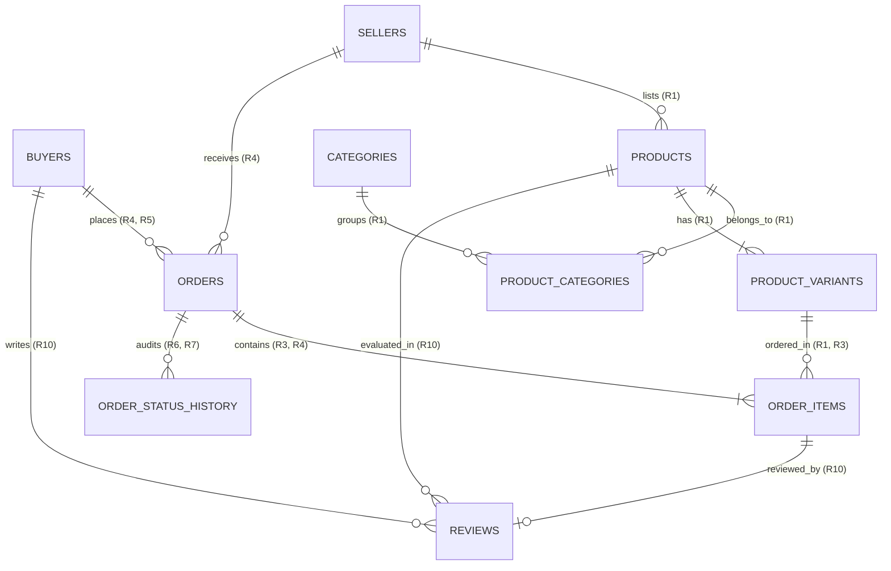
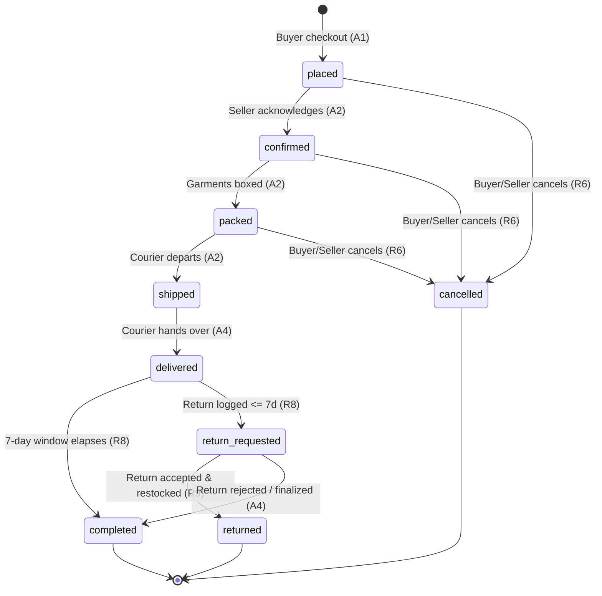

# WearHub System Architecture & Database Specification — Documentation

---

## 1. Executive Summary & Project Overview

**WearHub** is a ready-to-wear fashion marketplace designed for boutique fashion brands, merchants, and apparel shoppers in Lagos, Nigeria (operating in Nigerian Naira, **NGN**). 

The platform enables sellers to list apparel items in fixed sizes and colours with real-time stock management. Buyers discover ready-to-wear collections, place multi-item orders from individual sellers with locked checkout prices, track courier deliveries live, and pay cash on delivery.

This project is a rigorous system design and database architecture specification. The PostgreSQL 16 schema implements enterprise-grade database-level invariant enforcement, verified against heavy relational seed data (50,000 orders), execution query plans with buffer analytics, and defensive invariant rejection suites.

---

## 2. Core Actions & Functional Requirements

Every architectural decision, schema constraint, and API contract traces directly to the five core user actions (**A1**–**A5**) and ten functional requirements (**R1**–**R10**).

### 2.1 The Five Core Actions
- **A1 — Catalog Discovery & Checkout**: A buyer browses items by category, selects garments in a specific size and colour, and places an order. Stock is conditionally reserved and prices are snapshot.
- **A2 — Seller Fulfillment**: The merchant confirms, packs, and dispatches the order with a courier.
- **A3 — Live Order Tracking**: The buyer observes live status updates via Server-Sent Events (SSE).
- **A4 — Delivery, Completion & Returns**: The courier delivers the parcel. The order auto-completes after 7 days if no return is logged, or the buyer requests a return within the 7-day return window.
- **A5 — Verified Reviews**: The buyer submits a 1-to-5 star rating and comment on items from completed orders.

### 2.2 Functional Requirements Traceability Matrix

| ID | Action | Requirement Description | Database Enforcement Mechanism |
| :--- | :--- | :--- | :--- |
| **R1** | **A1** | **Variant Stock Availability**: Clothes are listed in fixed sizes/colours; out-of-stock variants cannot be ordered. | `product_variants.stock_quantity >= 0` via `ck_product_variants_stock_nonneg`. |
| **R2** | **A1** | **Concurrency & Oversell Protection**: Atomic conditional decrement prevents selling the same last item twice under high concurrency. | `UPDATE product_variants SET stock_quantity = stock_quantity - :qty WHERE id = :id AND stock_quantity >= :qty`. |
| **R3** | **A1** | **Snapshot Immutability**: Variant price, product name, size, and colour are locked at order creation; subsequent catalog edits do not alter receipts. | Snapshot columns in `order_items`: `unit_price_minor`, `product_name_snapshot`, `size_snapshot`, `colour_snapshot`. |
| **R4** | **A1** | **Single-Seller Order Purity**: Each order belongs to exactly one merchant. Multi-seller checkouts split into distinct orders. | Composite FKs: `fk_order_items_order_seller (order_id, seller_id)` and `fk_order_items_variant_seller (variant_id, seller_id)`. |
| **R5** | **A1, A4** | **Descending Order History**: Buyers retrieve order history ordered newest first. | B-Tree index `idx_orders_buyer_placed (buyer_id, placed_at DESC, id DESC)`. |
| **R6** | **A2, A4** | **Buyer Cancellation Guardrails**: Cancellation is permitted while `placed`, `confirmed`, or `packed`; strictly forbidden once `shipped`. | Trigger `trg_orders_enforce_transition` raises `order_transition_illegal`. |
| **R7** | **A3** | **Real-Time Tracking Timeline**: Live status updates streamed via SSE and audited in an append-only log. | `order_status_history` table + `idx_order_status_history_order (order_id, created_at)`. |
| **R8** | **A4** | **7-Day Return Window & Auto-Completion**: Buyers have 7 days post-delivery to request returns; delivered orders auto-complete after 7 days. | Partial index `idx_orders_delivered` on `orders(delivered_at) WHERE status = 'delivered'` for worker processing. |
| **R9** | **A2, A4** | **Automatic Restocking**: Cancelled orders and accepted returns restore inventory back to variant stock. | Stock adjustment transactions returning reserved units to `product_variants.stock_quantity`. |
| **R10** | **A5** | **Verified Purchase Reviews**: Exactly 1 review per item, restricted strictly to completed orders. | `uq_reviews_order_item`, `fk_reviews_order_completed`, and `ck_reviews_order_status_completed`. |

---

## 3. Relational Data Model (11 Tables)

The database schema is fully normalised to **Third Normal Form (3NF)** with strategic, documented denormalisations for financial snapshotting and query performance.



### 3.1 Entity Specifications

1. **`buyers`**: Customer profiles in Lagos.
   - Primary Key: `id uuid DEFAULT gen_random_uuid()`
   - Uniques: `email` (`uq_buyers_email`), `phone` (`uq_buyers_phone`)
   - Lifecycle: Soft-deleted and PII-anonymised under the Nigeria Data Protection Act (NDPA).
2. **`sellers`**: Apparel boutiques and fashion merchants.
   - Primary Key: `id uuid DEFAULT gen_random_uuid()`
   - Uniques: `shop_name` (`uq_sellers_shop_name`), `email` (`uq_sellers_email`)
   - Lifecycle: Soft-deleted via `deleted_at`.
3. **`categories`**: Taxonomy hierarchy for garment filtering.
   - Primary Key: `id uuid DEFAULT gen_random_uuid()`
   - Uniques: `name` (`uq_categories_name`), `slug` (`uq_categories_slug`)
   - Lifecycle: Hard delete restricted if products are linked (`ON DELETE RESTRICT`).
4. **`products`**: Garment catalog headers.
   - Primary Key: `id uuid DEFAULT gen_random_uuid()`
   - Foreign Keys: `seller_id` -> `sellers(id)` (`fk_products_seller`)
   - Uniques: `(id, seller_id)` (`uq_products_id_seller`)
   - Cached Aggregates: `rating_avg_x100` (e.g. 450 = 4.50 stars) and `rating_count` synced by trigger `trg_reviews_sync_product_rating`.
5. **`product_categories`**: Many-to-many join linking products to categories.
   - Primary Key: Composite `(product_id, category_id)` (`pk_product_categories`)
6. **`product_variants`**: Physical size and colour inventory units.
   - Primary Key: `id uuid DEFAULT gen_random_uuid()`
   - Uniques: `(product_id, size, colour)` (`uq_product_variants_product_size_colour`), `sku` (`uq_product_variants_sku`)
   - Constraints: `stock_quantity >= 0` (`ck_product_variants_stock_nonneg`), `price_minor > 0` (`ck_product_variants_price_positive`)
7. **`orders`**: Purchase orders placed with a single seller.
   - Primary Key: `id uuid DEFAULT gen_random_uuid()`
   - Foreign Keys: `buyer_id` -> `buyers(id)`, `seller_id` -> `sellers(id)`
   - Generated Columns: `total_minor GENERATED ALWAYS AS (subtotal_minor + delivery_fee_minor) STORED`
   - Deferred Integrity: Checked by `trg_orders_subtotal_matches` at `COMMIT`.
   - Lifecycle: **NEVER deleted** (immutable commercial contract).
8. **`order_items`**: Immutable line items snapshotting product details at checkout.
   - Primary Key: `id uuid DEFAULT gen_random_uuid()`
   - Uniques: `(order_id, variant_id)` (`uq_order_items_order_variant`)
   - Generated Columns: `line_total_minor GENERATED ALWAYS AS (unit_price_minor * quantity) STORED`
   - Multi-Tenant Composite FKs: `(order_id, seller_id)` -> `orders(id, seller_id)` and `(variant_id, seller_id)` -> `product_variants(id, seller_id)`.
   - Lifecycle: **NEVER deleted**.
9. **`order_status_transitions`**: Reference matrix of legal status transitions (11 rows).
   - Primary Key: `(from_status, to_status)` (`pk_order_status_transitions`).
10. **`order_status_history`**: Append-only lifecycle audit log.
    - Primary Key: `id uuid DEFAULT gen_random_uuid()`
    - Foreign Keys: `order_id` -> `orders(id)`
    - Lifecycle: **NEVER deleted**.
11. **`reviews`**: Post-delivery item evaluations.
    - Primary Key: `id uuid DEFAULT gen_random_uuid()`
    - Uniques: `order_item_id` (`uq_reviews_order_item`)
    - Composite Verification: `(order_id, buyer_id, order_status)` -> `orders(id, buyer_id, status)` where `order_status = 'completed'` (`fk_reviews_order_completed`, `ck_reviews_order_status_completed`).
    - Constraints: `stars BETWEEN 1 AND 5` (`ck_reviews_stars`).

---

## 4. Finite State Machine (FSM) & Lifecycle Rules

The order lifecycle is governed by an explicit state machine with exactly 11 allowed transitions enforced by database trigger `trg_orders_enforce_transition`.



### 4.1 Non-Obvious Forbidden Transitions

1. **`shipped -> cancelled`**: Forbidden. The parcel has physically left the boutique. Cancelling would break courier chain-of-custody and risk merchandise loss. The customer must receive the parcel and initiate a return.
2. **`completed -> return_requested`**: Forbidden. Status `completed` signals that the statutory 7-day return window has closed. Allowing returns post-completion undermines financial finality.
3. **`delivered -> cancelled`**: Forbidden. The customer is in physical possession of the items and paid cash on delivery. Cancelling an already-delivered order erases a completed sale.

---

## 5. Architectural & Database Design Decisions

### 5.1 The Minor Unit Money Rule
- **Zero Floating-Point Representation**: `FLOAT`, `DOUBLE`, and `NUMERIC` are forbidden for financial amounts to eliminate rounding discrepancies and IEEE 754 precision errors.
- **Minor Units (`bigint`)**: All prices and sums are stored as 64-bit integers in Nigerian Kobo (1 NGN = 100 Kobo).
- **Explicit Currency (`char(3)`)**: Every monetary record enforces uppercase ISO currency code `'NGN'`.
- **Generated Total Minor**: `order_items.line_total_minor` and `orders.total_minor` use `GENERATED ALWAYS AS ... STORED`, making arithmetic drift mathematically impossible.

### 5.2 Primary Key Strategy (UUIDv4)
All entities use random UUIDv4 identifiers (`uuid DEFAULT gen_random_uuid()`).
- **Mitigates Insecure Direct Object Reference (IDOR)**: Attackers cannot guess or iterate sequential IDs (e.g. `/orders/101`, `/orders/102`) to scrape customer PII or delivery addresses.
- **Prevents Business Intelligence Leakage**: Sequential IDs expose daily order velocity, total order volumes, and boutique sales metrics to competitors. UUIDs leak zero platform metadata.

### 5.3 Retention, Deletion & Privacy Policy
- **NDPA Account Erasure**: When a buyer requests account deletion, PII fields are scrubbed (`full_name = 'Deleted User'`, `email = 'anonymized@local'`, `phone = NULL`, `delivery_address = NULL`) and `deleted_at` is stamped.
- **Permanent Commercial Records**: `orders`, `order_items`, and `order_status_history` are never deleted to satisfy statutory accounting and tax compliance audits.

---

## 6. Performance Indexing & Query Benchmarks

Indexes are exclusively provisioned for named queries across **A1**–**A5**. Speculative indexes are omitted.

| Query / Action | Index Name | Definition | Scan Type Achieved |
| :--- | :--- | :--- | :--- |
| **Q1 (A1 Category Feed)** | `idx_product_categories_category` | `product_categories(category_id, product_id)` | **Index Only Scan** |
| **Q2 (A2 Seller Queue)** | `idx_orders_seller_open` | `orders(seller_id, placed_at) WHERE status IN ('placed', 'confirmed', 'packed')` | **Bitmap Index Scan** |
| **Q3 (A3 Tracking Screen)**| `idx_order_status_history_order` | `order_status_history(order_id, created_at)` | **Index Scan** |
| **Q4 (A4 Buyer History)** | `idx_orders_buyer_placed` | `orders(buyer_id, placed_at DESC, id DESC)` | **Bitmap Index Scan** (0.43 ms) |
| **Q5 (A5 Product Reviews)**| `idx_reviews_product_created` | `reviews(product_id, created_at DESC)` | **Index Scan** |

---

## 7. REST API & Real-Time Specifications

### 7.1 Protocol Standards
- **Base URL**: `https://api.wearhub.ng/v1`
- **Error Schema**:
  ```json
  {
    "error": {
      "code": "OUT_OF_STOCK",
      "message": "The selected garment variant is currently unavailable.",
      "details": []
    }
  }
  ```
- **Monetary Schema**:
  ```json
  {
    "amountMinor": 4500000,
    "currency": "NGN"
  }
  ```
- **Idempotency**: `POST /v1/orders` enforces `Idempotency-Key: <UUID>`. Replays with identical payloads return the existing order (`200 OK`); replays with mismatched payloads return `422 IDEMPOTENCY_KEY_PAYLOAD_MISMATCH`.

### 7.2 Core Action Endpoint Summary

| Action | Method & Path | Purpose | Key Error Codes |
| :--- | :--- | :--- | :--- |
| **A1** | `GET /v1/categories/{categoryId}/products` | List category garments with variant prices | `404 CATEGORY_NOT_FOUND` |
| **A1** | `POST /v1/orders` | Checkout single-seller order | `409 OUT_OF_STOCK`, `422 MIXED_SELLERS` |
| **A2** | `POST /v1/orders/{orderId}/confirm` | Seller acknowledges order | `409 INVALID_TRANSITION` |
| **A2** | `POST /v1/orders/{orderId}/pack` | Garment packed | `409 INVALID_TRANSITION` |
| **A2** | `POST /v1/orders/{orderId}/ship` | Courier dispatched | `409 INVALID_TRANSITION` |
| **A3** | `GET /v1/orders/{orderId}/live` | SSE live status stream (`text/event-stream`) | `404 ORDER_NOT_FOUND` |
| **A4** | `POST /v1/orders/{orderId}/deliver` | Courier marks delivery | `409 INVALID_TRANSITION` |
| **A4** | `POST /v1/orders/{orderId}/return-request` | Return request within 7 days | `409 RETURN_WINDOW_CLOSED` |
| **A4** | `POST /v1/orders/{orderId}/cancel` | Buyer cancellation before shipment | `409 ALREADY_SHIPPED` |
| **A5** | `POST /v1/order-items/{orderItemId}/review` | Verified purchase review | `409 ORDER_NOT_COMPLETED`, `409 ALREADY_REVIEWED` |

### 7.3 Real-Time Technology Selection (SSE vs WebSockets)
- **Decision**: **Server-Sent Events (SSE)** selected over WebSockets.
- **Rationale**: Order tracking is strictly unidirectional (server pushes state changes to client). SSE runs over standard HTTP/2, traverses corporate/mobile proxies without custom port tunneling, and features native reconnection with `Last-Event-ID` across flaky mobile cellular networks in Lagos.

---

## 8. Prisma ORM Schema Alignment

The Prisma schema in [`prisma/schema.prisma`](file:///c:/Users/PC/Desktop/WearHub%20API%20Design/prisma/schema.prisma) mirrors the PostgreSQL 16 schema 1:1, including:
- PostgreSQL enum mapping (`order_status`)
- Direct `@map` and `@@map` bindings for snake_case table and column names
- Explicit constraint mappings matching `pk_`, `fk_`, `uq_`, and `idx_` naming conventions
- `BigInt` scalar types for minor-unit currency columns
- Explicit relations supporting single-seller multi-tenant composite constraints

---

## 9. Verification & Execution Guide

### 9.1 Database Container Management
```powershell
# Reset container and volume to a clean state
docker compose down -v
docker compose up -d

# Verify container connectivity
docker exec -it weardb psql -U postgres -d wearhub -c "select 1"
```

### 9.2 Running Migrations, Seeds & Benchmarks
```powershell
# 1. Apply Schema Migration
cmd /c "docker exec -i weardb psql -U postgres -d wearhub -v ON_ERROR_STOP=1 < db\migrations\001_schema.sql"

# 2. Seed Database (50,000 orders, 8,000 variants, 5,000 buyers, 51,241 reviews)
cmd /c "docker exec -i weardb psql -U postgres -d wearhub -v ON_ERROR_STOP=1 < db\seed.sql"

# 3. Execute Benchmarking Queries & Query Plans
cmd /c "docker exec -i weardb psql -U postgres -d wearhub < db\queries.sql"

# 4. Run Defensive Invariant Violations Suite
cmd /c "docker exec -i weardb psql -U postgres -d wearhub < db\invalid.sql"
```

---

## 10. Document & Evidence Directory Map

- **Specification Documents**:
  - [`Docs/FINAL.md`](file:///c:/Users/PC/Desktop/WearHub%20API%20Design/Docs/FINAL.md): Consolidated final design specification.
  - [`Docs/01-requirements.md`](file:///c:/Users/PC/Desktop/WearHub%20API%20Design/Docs/01-requirements.md): Scope, user roles, and requirements R1–R10.
  - [`Docs/02-data-model.md`](file:///c:/Users/PC/Desktop/WearHub%20API%20Design/Docs/02-data-model.md): 11 tables, types, and entity relationships.
  - [`Docs/03-decisions.md`](file:///c:/Users/PC/Desktop/WearHub%20API%20Design/Docs/03-decisions.md): Normalisation, money rules, state transitions, constraints, and retention.
  - [`Docs/04-api.md`](file:///c:/Users/PC/Desktop/WearHub%20API%20Design/Docs/04-api.md): REST contracts, SSE live tracking, over-fetching, and idempotency.
  - [`Docs/05-query-plans.md`](file:///c:/Users/PC/Desktop/WearHub%20API%20Design/Docs/05-query-plans.md): Query plans with buffer analytics.
- **Database Scripts**:
  - [`db/migrations/001_schema.sql`](file:///c:/Users/PC/Desktop/WearHub%20API%20Design/db/migrations/001_schema.sql): PostgreSQL 16 DDL migration.
  - [`db/seed.sql`](file:///c:/Users/PC/Desktop/WearHub%20API%20Design/db/seed.sql): Production-scale dataset generation.
  - [`db/queries.sql`](file:///c:/Users/PC/Desktop/WearHub%20API%20Design/db/queries.sql): Q1–Q5 benchmark queries with `EXPLAIN (ANALYZE, BUFFERS)`.
  - [`db/invalid.sql`](file:///c:/Users/PC/Desktop/WearHub%20API%20Design/db/invalid.sql): Invariant rejection test cases.
- **Evidence Images**:
  - [`evidence/erd.png`](file:///c:/Users/PC/Desktop/WearHub%20API%20Design/evidence/erd.png): Entity-Relationship diagram.
  - [`evidence/state-machine.png`](file:///c:/Users/PC/Desktop/WearHub%20API%20Design/evidence/state-machine.png): Order state machine diagram.
  - [`evidence/plan-q1.png`](file:///c:/Users/PC/Desktop/WearHub%20API%20Design/evidence/plan-q1.png): Q1 Category feed query plan.
  - [`evidence/plan-q4.png`](file:///c:/Users/PC/Desktop/WearHub%20API%20Design/evidence/plan-q4.png): Q4 Buyer order history query plan.
  - [`evidence/reject-1.png`](file:///c:/Users/PC/Desktop/WearHub%20API%20Design/evidence/reject-1.png): Stock overselling check violation.
  - [`evidence/reject-2.png`](file:///c:/Users/PC/Desktop/WearHub%20API%20Design/evidence/reject-2.png): Premature review on uncompleted order violation.
  - [`evidence/reject-3.png`](file:///c:/Users/PC/Desktop/WearHub%20API%20Design/evidence/reject-3.png): Illegal order transition violation.
- **Prisma & Configuration**:
  - [`prisma/schema.prisma`](file:///c:/Users/PC/Desktop/WearHub%20API%20Design/prisma/schema.prisma): Prisma ORM data model.
  - [`package.json`](file:///c:/Users/PC/Desktop/WearHub%20API%20Design/package.json): Locked stack dependencies.
  - [`docker-compose.yml`](file:///c:/Users/PC/Desktop/WearHub%20API%20Design/docker-compose.yml): PostgreSQL 16 container orchestrator.
